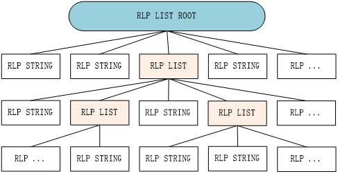
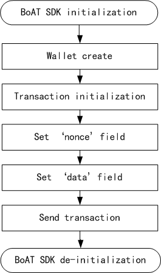

# BoAT Overall Design

## Introduction

### Overview
This article describes the overall design of the BoAT system, including architecture design, subsystem functions, internal and external interfaces, key processes and key technology design descriptions, in order to guide the overall design of each subsystem and the writing of test strategies/specifications.  
The intended readers of this article are: BoAT SDK detailed designers.

### Abbreviated Terms
|Term   |Explanation                  |
|:----- |:--------------------------- |
|ABI    |Application Binary Interface |
|BoAT   |Blockchain of AI Things      |
|RLP    |Recursive Length Prefix      |
|RNG    |Random Numeral Generator     |
|RPC    |Remote Procedure Call        |
|TEE    |Trusted Execution Environment|

## BoAT Design Goals
As a middleware fusing Blockchain and IoT technologies, it should be efficiently transplanted into various IoT modules and at a minimum modification cost. The design of BoAT is based on the following principles:
+ Hierarchical design  
+ Multiple blockchain protocols are supported  
+ Scalable design  
+ Secret key security design  
+ C interface code generation tool for corresponding smart contracts of different blockchains  

## The Position of BoAT SDK in The Entire Blockchain Network
As a middleware connecting IoT devices and blockchain, BoAT SDK's position in the entire interactive network is shown in Figure 3-1.  
  
Figure 3-1 The position of BoAT in the blockchain interactive network  

## BoAT Implementation Framework 
BoAT follows a hierarchical design consisting of Interface Layer, Protocol Layer, RPC Layer, Vendor Dependency Layer, Tool and Utility. The specific functions of each layer are as follows:   
+ Interface Layer: Provides an interface for IoT applications to invoke the corresponding blockchain. 
+ Protocol Layer: The primary implementation of each blockchain protocol.  
+ RPC Layer: Provides services for the protocol layer.  
+ Vendor Dependency Layer: Provides cryptographic algorithms, signature, storage, and other services for the interface layer wallet.  
+ Tool: The general tool is used to generate the C language interface of the smart contract.
+ Utility: The utility program provides data format conversion, message encoding, and decoding to each layer.

The overall framework of BoAT is shown in Figure 4-1.  
   
Figure 4-1 BoAT Overall Framework  

### Interface Layer

#### Overview
The interface layer is located at the top layer of BoAT and provides IoT applications with the access to each blockchain. The interface layer consists of two parts:  
+ Wallet interface
   * The wallet interface is the entrance to the BoAT SDK, and different blockchains have a common wallet entrance.
+ Transaction interface
   * Each blockchain provides a set of transaction interfaces with similar functions but different implementations.  

The wallet interface of the interface layer is supported by the vendor dependency layer. For the description of the vendor dependency layer, please refer to [Vendor Dependency Layer](#vendor-dependency-layer).  
The transaction interface of the interface layer is supported by the protocol layer. For a description of the protocol layer, please refer to [Protocol layer](#protocol-layer).  

#### Wallet Interface

##### The Data Structure and Function Implementation List of The Wallet
The wallet is a container responsible for storing the information necessary to access the blockchain. It also contains a key management system corresponding to the wallet's data structure and implementation method.

When the BoAT SDK runs on the application processor of the cellular module, which can only provide a resource-constrained operating environment. For example, some cellular modules may not provide non-volatile memory access interfaces; on the other hand, from the user's point of view, some users may want to create a temporary wallet for testing but don't want to store it for a long time. In view of this, in the design of BoAT SDK, wallets are divided into two categories: persistent wallets and one-time wallets. Persistent wallets are stored in the non-volatile memory of the operating environment and will not be lost when power is off. One-time wallets are stored in the RAM of the operating environment and will be lost when power is off.  
  
In the data structure of the wallet, It should contain at least the following elements:  
  + Account private key
  + Blockchain network information
  + RPC interface information

In addition to the elements that must be included, the data structure of the wallet can optionally include:  
  + Account address  

The wallet should provide the following functions to achieve:
  + SDK initialization
  + SDK de-initialization
  + Wallet creation
  + Delete wallet
  + Wallet uninstalls
  + Query wallet information according to the index
  + Private key settings
  + Private key generation
  + Private key verification

##### Brief Description of Wallet Interface Function Realization

###### SDK Initialization / De-initialization

+ SDK initialization:
SDK initialization should be done before using BoAT SDK. The contents of this interface include:
   1. Initialization of wallet list  
The wallet list is a data structure that contains a fixed number of wallets and wallet-related usage information. The wallet-related usage information includes wallet usage identification, wallet name, and blockchain to which the wallet belongs. The wallet list is a global resource. The initialization of the wallet list means that each member in the data structure is initialized once, such as initializing the usage identification as unused.  
   2. Other global resource initialization  
If some third-party libraries used by the SDK need to be initialized before calling, they should be initialized here, such as the third-party library cURL used by the RPC layer.

+ SDK de-initialization:
After using BoAT SDK, you should do SDK de-initialization to release resources. The content of this interface includes:
   1. Perform wallet uninstall  
   2. Other global resource de-initialization  
If some third-party libraries used by the SDK need to be de-initialized before being called, they should be placed here for de-initialization, such as the third-party library cURL used by the RPC layer

###### Wallet Operation

+ Wallet creation:
This interface is used to realize the creation of a new wallet or the reading of an already created wallet. The contents of this interface include:  
  1. Check if the wallet list is full  
  2. Decide whether to create a new wallet or read the created wallet according to the specific input parameters  
  3. Decide whether to create a one-time wallet or a persistent wallet according to the specific input  
  4. Perform wallet initialization of a certain blockchain according to specific input parameters, such as performing Ethereum wallet initialization, or performing PlatONE wallet initialization
+ Delete wallet:
This interface deletes a persistent wallet from non-volatile memory.  
Note: This interface does not uninstall the wallet from RAM. After the persistent wallet is deleted, it becomes a one-time wallet. The content implemented by this interface includes:
  1. Delete the specified wallet file from the non-volatile memory
+ Unload wallet:
This interface is used to unloads a wallet from RAM.  
Note: This interface only unload the wallet from RAM and does not delete the wallet from non-volatile memory. The content implemented by this interface includes:
  1. Perform wallet de-initialization of a certain blockchain according to specific input parameters, such as performing Ethereum wallet de-initialization, or performing PlatONE wallet de-initialization
+ Query wallet information according to the index:
This interface is used to query the wallet. The content implemented by this interface includes:
  1. Return the corresponding wallet information address according to the specific input parameters (input parameters can be storage serial number index value, wallet address, etc.)  

###### Private Key Operation

+ Private key settings:
This interface is used to set the private key of the wallet. The private key should be kept carefully. The content implemented by this interface includes:
  1. Perform private key verification  
  2. Perform private key assignment  
  3. Generate public key from private key (optional)  
  4. Generate address by public key (optional)  

+ Private key generation:
This interface is used to generate a valid private key. The content implemented by this interface includes:  
  1. Generate a private key by generating a random number  
  2. Perform private key verification  
  3. If the verification fails, return to step 1 to regenerate the private key, and if the verification succeeds, return the generated private key  
+ Private key verification:
This interface is used to check whether the given private key is valid. The content implemented by this interface includes:  
  1. Check whether the private key is in the valid private key range  

#### Transaction Interface

##### Transaction Data Structure and Function Realization List
A transaction is a signed message, transmitted through the blockchain network and recorded on the blockchain. The functions of transaction interfaces provided by different blockchains are basically the same.  

For Ethereum/PlatON/PlatONE/FISCO BCOS:

The transaction should contain at least the following elements:
+ The data structure of the wallet
+ Transaction identification
+ Messages required for transactions  

The transaction should provide the following functions:
+ Wallet initialization
+ Wallet de-initialization
+ Account balance inquiry
+ Transaction initialization
+ Send transaction
+ Query transaction receipt
+ Stateless message call  
  
 

##### Brief Description of Ethereum Transaction Interface Function Implementation
+ Wallet initialization:
  The content implemented by this interface includes:
  1. Set the blockchain contract address
  2. Set whether the transaction specifies a chain ID
  3. Set chain ID
+ Wallet de-initialization:
  The content implemented by this interface includes:
  1. Reset private key information
  2. Release of blockchain network information resources
  3. Call the web3 interface provided by the protocol layer: de-initialize the web3 interface
+ Account balance inquiry:
  The content implemented by this interface includes:
  1. Prepare message information required for account balance inquiry
  2. Call the web3 interface provided by the protocol layer: get the account balance
+ Transaction initialization:
  This interface is mainly implemented to initialize the fields in the transaction structure. In addition to the three fields of signature v, r, and s, the transaction structure of Ethereum also has six fields including nonce, gasPrice, gasLimit, recipient, value, and data. Please note that the setting of the Nonce field of the transaction is not implemented in this interface, but is set at the time the transaction is sent, because the user may create multiple transaction messages at the same time, and the order in which these messages are sent to the blockchain network is not sure. In addition, it should be noted that the Nonce and gasPrice fields should be obtained from the blockchain by calling the corresponding web3 interface of the protocol layer. This method requires access to the network and will generate a certain amount of network traffic. The content implemented by this interface includes:
  1. Set the GasPrice field of the transaction
  2. Set the GasLimit field of the transaction
  3. Set the Recipient field of the transaction
  4. Set the Value field of the transaction
+ Send transaction  
  The content implemented by this interface includes:
  1. Determine to send synchronous/asynchronous identification (if any)
  2. Identified as synchronous sending: call the raw transaction interface provided by the protocol layer: raw transaction synchronous sending
  3. Identified as asynchronous transmission: call the raw transaction interface provided by the protocol layer: raw transaction asynchronous transmission
+ Check transaction receipt:
  The content implemented by this interface includes:
  1. Prepare to query message information required for transaction receipt
  2. Call the web3 interface "get transaction receipt" provided by the protocol layer once every specified time until the timeout period is triggered
  3. Return query result
+ Send Ether  
  The content implemented by this interface includes:
  1. Set the Nonce field of the transaction
  2. Set the Value field of the transaction
  3. Set the Data field of the transaction
  4. Execute sending transaction
+ Stateless message call:
  The content implemented by this interface includes:  
  1. Prepare message information needed for stateless message call  
  2. Call the web3 interface "blockchain stateless call" provided by the protocol layer  

##### Brief Description of PlatON Transaction Interface Function Implementation
There are three main differences between PlatON and Ethereum:  
  1. The addresses are different.  
  PlatON adds an additional bitcoin like Bech32 format address to Ethereum. Therefore, when initializing a transaction, you need to set HRP (Human-readable Parts) for the address in addition to the parameters that Ethereum requires. The wallet will automatically use the specified address format when invoking RPC.  
  2. The names of functions invoked through RPC are different.  
  There is no difference for BoAT SDK users.  
  3. PlatON must use the specified blockchain ID mode.
  EIP-155 describes two data formats that can be used for transactions, but PlatON supports only one, more detail see [Brief Description of Raw Transaction Interface](#brief-description-of-raw-transaction-interface).  

When designing the data structure and code implementation of PlatON, we should consider the inheritance of data structure and the reuse of code implementation, so as to reduce the amount of code and facilitate maintenance. Although PlatON's transaction structure is the same as Ethereum, bech32 addresses are required for calls in some RPC commands. Therefore, in the design of data structure, two fields are added to store the address in Bech32 format. The possible design ideas are shown in Figure 4-2:  
  
Figure 4-2 illustrates one possible data structure design idea for PlatON  
Note that the two additional address fields for PlatON should be placed at the end of the data structure without compromising the integrity of the reused Ethereum data structure. Disrupting the integrity of Ethereum's data structure will make the implementation methods associated with that data structure in Ethereum unreusable.

##### Brief Description of PlatONE Transaction Interface Function Implementation
Compared with Ethereum, the differences are listed below:
+ Transaction initialization  
In addition to the initialization steps described by Ethereum, PlatONE also:
  1. Set transaction type field  

It can be seen from the foregoing that the difference between PlatONE and Ethereum is very small. When designing the data structure and code implementation of PlatONE, the inheritance of the data structure and the reuse of code implementation should be considered, which not only reduces the amount of code, but also facilitates maintenance. For example, the composition of the transaction structure. The transaction structure of PlatONE has one more transaction type field than the transaction structure of Ethereum. Therefore, in the design of the data structure, a possible design idea is shown in Figure 4-3.  
  
Figure 4-3 A possible design idea of data structure  
Figure 4-3 describes a possible data structure design idea of PlatONE. Please note that the transaction type field of PlatONE should be placed at the end of the data structure, and the integrity of the data structure of the multiplexed Ethereum should not be destroyed. If the integrity of the data structure of Ethereum is destroyed, the implementation methods related to the data structure in Ethereum will not be reused.

##### Brief Description of FISCO BCOS Transaction Interface Function Implementation
Compared with Ethereum, the differences please refer to FISCO BCOS official documentation https://fisco-bcos-documentation.readthedocs.io/en/latest/docs/design/protocol_description.html.  

When designing the data structure and code implementation of FISCO BCOS, the inheritance of data structure and the reuse of code implementation should be considered, so as to reduce the amount of code and facilitate maintenance. The following four fields have been added to the transaction structure:  
  1. blockLimit
  2. chainId
  3. groupId
  4. extraData
Therefore, in the design of the data structure, a possible design idea is shown in Figure 4-4.  
  
Figure 4-4 A possible design idea of data structure  
Figure 4-4 describes a possible data structure design idea of FISCO BCOS. Please note that the transaction type field of FISCO BCOS should be placed at the end of the data structure, and the integrity of the data structure of the multiplexed Ethereum should not be destroyed. If the integrity of the data structure of Ethereum is destroyed, the implementation methods related to the data structure in Ethereum will not be reused.  

***Note: Since FISCO BCOS adds new fields to transactions, RLP coding is different from Ethereum. See the RC2 section linked in this chapter for details.***

##### Brief Description of Fabric Transaction Interface Function Implementation
+ Wallet initialization:
  The content implemented by this interface includes:
  1. Request space for the wallet structure.
  2. Set up the private key path/index of the account.
  3. Set up the certificate of the account.
  4. If you need to support TLS, set the root certificate to be used when TLS verifies the identity of the server.
  5. If TLS needs to support two-way authentication, the client's private key path/index and corresponding certificate should also be set.
  6. Set node information, such as endorsement node and sorting node numbers, address, host name. If TLS is enabled, the hostname field will be used to authenticate the server's identity, which is the same as the CN field in the server's TLS certificate. If TLS is not enabled, the host name is ignored.
  7. Initialize the HTTP2 environment.
+ Wallet de-initialization:
  The content implemented by this interface includes:
  1. Free the space applied for the account private key path/index and certificate.
  2. Free the space applied for TLS client private key path/index and certificate (if TLS is enabled).
  3. Free the space applied for the root certificate (if TLS is enabled).
  4. Free the space applied for endorsement/sorting node information.
  5. Uninitialized the HTTP2 environment.
  6. Free the space applied for the wallet structure.
+ Transaction initialization:
  The content implemented by this interface includes:
  1. Set the attributes of the chain code to be accessed by the transaction: path, name, version.
  2. Set the channel name of the client that initiates the transaction.
  3. Set the organization name of the client that initiates the transaction.
+ Wallet de-initialization:
  The content implemented by this interface includes:
  1. Free the space applied for chain code property.
  2. Free the space applied for channel name.
  3. Free the space applied for organization name.
+ Transaction parameter setting:
  The content implemented by this interface includes:
  1. Set the timestamp of the transaction initiation.
  2. Set the parameters of the transaction. 
+ Send transaction
  The content implemented by this interface includes:
  1. Send the submit messages.
  2. Send the evaluate messages.

### Protocol Layer
#### Overview
The protocol layer is located in the second layer of the BoAT SDK, which mainly implements the protocol part of each blockchain. For Ethereum series blockchains, their protocols are very similar, such as Ethereum, PlatON, PlatONE and FISCO BCOS.   
The protocol layer is supported by the RPC layer. Please refer to [RPC Layer](#rpc-layer).  

#### Ethereum's Protocol Layer Implementation
##### Raw Transaction Interface
The raw transaction interface of the protocol layer provides services for "sending transactions" to the transaction interface of the interface layer.Raw transaction upwards should provide at least the following interfaces:
+ raw transaction sent asynchronously    

In addition, raw transaction can also choose to provide the following interfaces:
+ raw transaction sent synchronously

##### Brief Description of Raw Transaction Interface

+ raw transaction sent asynchronously  
This interface implements the data encoding of raw transaction, such as RLP encoding of each field, hash calculation, signature, etc., and calls the web3 interface within the protocol layer to send it to the blockchain, and returns directly without waiting for the transaction be confirmed. There are two types of data encoding: specifying the chain ID and not specifying the chain ID. Refer to EIP-155 for details <https://eips.ethereum.org/EIPS/eip-155>.  
The content implemented by this interface includes:

   - If the data encoding is not specifying the chain ID:
  1. Perform RLP encoding on the six fields of nonce, gasPrice, gasLimit, recipient, value, and data of the transaction
  2. Calculate the keccak-256 hash value of the RLP encoding in the previous step
  3. Sign the hash value of the previous step, and get the three values of parity, r, and s
  4. Perform RLP encoding on the nine fields of transaction nonce, gasPrice, gasLimit, recipient, value, data, v, r, s, where v = parity + 27, parity, r, s have been given in the previous step
  5. Call the web3 interface "send rawtransaction" to send to the blockchain

   - If the data encoding is specifying the chain ID:
  1. Perform RLP encoding on the nine fields of transaction nonce, gasPrice, gasLimit, recipient, value, data, v, r, s, where v = chainID, r = 0, s = 0
  2. Same as step 2 of "not specifying the chain ID"
  3. Same as step 3 of "not specifying the chain ID"
  4. Perform RLP encoding on the nine fields of the transaction, including nonce, gasPrice, gasLimit, recipient, value, data, v, r, s, where v = Chain ID * 2 + parity + 35, and parity, r, s have been given in the previous step
  5. Same as step 5 of "not specifying the chain ID"

+ raw transaction sent synchronously  
This interface executes "raw transaction asynchronous sending" and waits for the transaction to be confirmed after success or timeout. The content implemented by this interface includes:
  1. Execute raw transaction synchronously
  2. Execute query transaction receipt
  3. Wait for the transaction to be confirmed or return after timeout

##### Web3 Interface
In addition to the raw transaction interface, the protocol layer should also provide the following web3 interfaces to the upper layer:
+ web3 interface initialization
+ web3 interface de-initialization
+ Get the content stored in the specified location of the blockchain
+ Get the number of account transactions
+ Get blockchain gasPrice
+ Get account balance
+ Get transaction receipt
+ Blockchain stateless call
+ Send raw transaction  

Looking through the RPC-related documents of Ethereum, you can know that Ethereum provides about 64 RPC methods. In the BoAT SDK, we only implement the above. The reason is the same as the description in [Wallet interface](#wallet-interface). The resources of the SDK operating environment are limited. The above-mentioned RPC methods are several methods commonly used in data on the blockchain. If customers need other RPC methods in the future, BoAT SDK will provide them in a customized way.

##### Brief Description of Web3 Interface
+ web3 interface initialization  
  The content implemented by this interface includes:
  1. Web3 interface resource application, Such as the memory space application of RPC content, Application for the memory space of the json string used to request or respond from the blockchain, Request for memory space of the parsed result of the response json string
  2. Initialize web3 message ID
  3. Perform "RPC interface initialization" of the RPC layer
+ web3 interface de-initialization  
  The content implemented by this interface includes:
  1. The release of web3 interface resources, such as the release of memory space for RPC content,It is used to release the memory space of the json string that requests or responds from the blockchain, The memory space of the parsed result of the response json string is released.
  2. Perform "RPC interface de-initialization" of the RPC layer
+ Get the content stored in the specified location of the blockchain  
  The content implemented by this interface includes:
  1. web3 message ID increment
  2. Package the request message of 
  3. "Get the content stored in the specified location of the blockchain"
  4. Call the RPC method "web3_getStorageAt" to send the request message to the blockchain
  5. Parse the received block chain response message and return the analysis result
+ Get the number of account transactions  
  The content implemented by this interface includes:
  1. web3 message ID increment
  2. Package the request message of "Get account transactions"
  3. Call the RPC method "web3_getTransactionCount" to send the request message to the blockchain
  4. Parse the received blockchain response message and return the analysis result
+ Get the gasPrice of the blockchain  
  The content implemented by this interface includes:
  1. web3 message ID increment
  2. Package the request message of "Get the gasPrice of the blockchain"
  3. Call the RPC method "web3_gasPrice" to send the request message to the blockchain
  4. Parse the received blockchain response message and return the analysis result
+ Get account balance  
  The content implemented by this interface includes:
  1. web3 message ID increment
  2. Package the request message of "Get account balance"
  3. Call the RPC method "web3_getBalance" to send the request message to the blockchain
  4. Parse the received blockchain response message and return the analysis result
+ Get transaction receipt  
  The content implemented by this interface includes:
  1. web3 message ID increment
  2. Package the request message of "get transaction receipt"
  3. Call the RPC method "web3_getTransactionReceiptStatus" to send the request message to the blockchain
  4. Parse the received blockchain response message and return the analysis result
+ Blockchain stateless call  
  The content implemented by this interface includes:
  1. web3 message ID increment
  2. Package the request message of "Blockchain stateless call"
  3. Call the RPC method "web3_call" to send the request message to the blockchain
  4. Parse the received blockchain response message and return the analysis result
+ Send raw transaction  
  The content implemented by this interface includes:
  1. web3 message ID increment 
  2. Package the request message of "Send raw transaction"
  3. Call the RPC method "web3_sendRawTransaction" to send the request message to the blockchain
  4. Parse the received blockchain response message and return the analysis result

#### Protocol Layer Implementation of PlatON  
The protocol implementation of PlatON is exactly the same as that of Ethereum except that PlatON only supports data encoding using specified chain ID.  

#### Protocol Layer Implementation of PlatONE
The implementation of PlatONE's protocol layer is almost the same as that of Ethereum. The only difference is that the data field of raw transaction is filled with one more transaction type encoding, and has one more transaction type field in the RLP process of raw transaction. Because the data field is filled by users who use BoAT SDK before calling BoAT SDK-related APIs, the protocol layer of PlatONE can reuse the protocol layer of Ethereum.

#### Protocol Layer Implementation of FISCO BCOS
The protocol layer implementation of FISCO BCOS is almost the same as that of Ethereum. The only difference is that there are four more fields encoded in the RLP encoding process of raw Transaction. Because the RLP coding for the raw transaction is implemented by the user using the BoAT SDK before calling the BoAT SDK related APIs, the FISCO BCOS protocol layer can reuse Ethereum's protocol layer.  

#### Protocol Layer Implementation of Fabric
##### Brief Description of Fabric Protocol Layer
The Fabric protocol layer mainly contains proposal protocol and transaction protocol, and the query protocol is the same as the proposal protocol. Proposal agreement and transaction agreement are respectively as follows Figure 4-5,Figure 4-6:  
  
Figure 4-5 Fabric proposal protocol struct  
  
Figure 4-6 Fabric transaction protocol struct  

When Fabric client launches a deal,will first send proposal to endorse node, get the data of proposal signature returned after endorse node signatures. then the Fabric client puts the data endorse signature together with transaction parameters according to the transaction message format and sends to order nodes. After order node check through, it will updating the state of the chain. The detailed transaction process is shown in Figure 4-6,This figure is taken from the <Hyperledger-FabricDocs Master> document. For more information on Fabric, refer to the Fabric documentation: <https://hyperledger-fabric.readthedocs.io/en/release-1.4/>.  
  
Figure 4-7 Fabric transaction flow  
#####	Fabric protocol interface implementation
In the Fabric message, the fields in the protocol are serialized through ProtoBuf and then sent out through the HTTP2 protocol. As can be seen from the preface section, there are some duplicates and similarities between the proposal and transaction messages, and these duplicates can be split into a submodule for easier reuse. One possible split is listed as follows:
-	channelHeader packaging
-	signatureHeader packaging
-	proposal load packaging
-	transaction load packaging

### RPC Layer

#### Overview

The RPC layer implements the encapsulation of the specific link that sends data to the blockchain node, and provide services to the protocol layer. The RPC layer is an abstraction of the concrete realization of the sending link, so that the BoAT SDK can be transplanted to different operating environments more conveniently.

#### Scalable Design of RPC Layer
The RPC layer expands down to implement different sending links according to the specific operating environment. For example, some environments provide the transmission tool cURL, you can use curl to send and receive messages. Some environments do not support cURL, but provide AT commands to send and receive messages. The RPC layer encapsulates these different implementations. The layer provides a unified interface, so that the protocol layer does not need to care about the specific transmission link, and only needs to call the unified interface when sending and receiving messages. The RPC layer's encapsulation of different links also facilitates the expansion of more link implementations.

##### Extension of RPC Layer to cURL
cURL is a file transfer tool that uses URL syntax to work under the command line. It supports multiple communication protocols such as FTP, FTPS, HTTP, and HTTPS. When the RPC layer enables cURL support, in addition to the global resource initialization of cURL when the SDK is initialized, it must also be implemented at the RPC layer:
   1. cURL session initialization
   2. Set the URL format to\<protocol\>://<target name | IP>:\<port\>
   3. Configure the protocol supported by cURL
   4. Configure SSL certificate (if needed)
   5. Set HTTP type to POST
   6. Set the timeout period (response timeout, connection timeout)
   7. Set HTTP header information
   8. Set the callback function of HTTP message response and receive buffer
   9. Set POST content
   10. Perform RPC request
   11. CURL resource cleaning and recycling  

### Vendor Dependency Layer
#### Overview
The Boat SDK will run on different hardware platforms, because the various hardware platforms provided by various vendors have various functions. For example, some hardware platforms provide hardware implementation of random number generator, while some hardware platforms provide not only hardware implementation of random number generator, but also TEE environment. In order to leverage the platform's resources and to isolate changes in the software, the Boat SDK designed a vendor dependencylayer. The vendor dependency layer provides services such as random number generator, secure storage, encrypted signature and so on to the wallet in the interface layer. When the hardware platform can provide the corresponding implementation, the vendor dependency layer will call the corresponding hardware function through the interface reserved by the vendor. When the hardware platform does not provide some services, the corresponding functions are realized by pure software.

#### Software Implementation of The Vendor Dependency Layer
The vendor dependency layer should provide a pure software implementation of the required services. This allows the Boat SDK to function properly even when the hardware does not provide the required services. The vendor dependency layer should cover the necessary hardware services as a standard, providing at least a software-only implementation of the following functions:
+ Random number generator
+ Signature (such as ECDSA used by Ethereum)
+ Secure storage (such as storing private keys in an encrypted manner)
+ Hash algorithm (such as Keccak-256 used by Ethereum)

#### TEE Support
The design of BoAT should consider the support of TEE environment. For hardware with a TEE environment, BoAT should be able to put sensitive information in the TEE environment with a small amount of modification. To meet this goal, the wallet is designed to meet the following criteria:
+ Wallet related data structure modular design
+ Wallet related implementation modular design
+ Sensitive information related to the wallet is not reflected outside the wallet

### General Tool Implementation

#### Overview
General tools exist independently of each layer and are used to generate C language interfaces for accessing blockchain smart contracts. General tools should be implemented in scripting languages. Common tools include:
+ Tool used to generate C language interface of Ethereum smart contract
+ Tool used to generate C language interface of PlatONE smart contract
+ Tool used to generate C language interface of FISCO BCOS smart contract

#### Brief Description of General Tools

##### Tool for Generating C Language Interface of Ethereum Smart Contract
The commonly used programming language for Ethereum smart contracts is solidity. After solidity is compiled, a JSON file describing the contract interface will be generated. The JSON format of the contract interface is given by an array of function and/or event descriptions. The description of a function is a JSON object with the following fields:
+ type: "function" , "constructor" , "receive" (Function to receive Ether) or "fallback"( Default function)
+ name: Function name
+ inputs: Object array, each array object will contain:
   - name: parameter name；
   - type: Authoritative type of parameter 
   - components: For tuple type
+ outputs: An array of objects similar to inputs, which can be omitted if the function has no return value
+ payable: If the function accepts Ether, it is true; the default is false
+ stateMutability: One of the following values: pure (specified not to read the state of the blockchain), view (specified not to modify the state of the blockchain), nonpayable and payable (same as payable above)
+ constant: True if the function is specified as pure or view  

For the generated C language contract interface, the corresponding relationship with the JSON object is as follows:
<table>
    <tr>
        <td colspan="2">JSON object</td>
        <td>JSON object value</td>
        <td>C language contract interface</td>
    </tr>
    <tr>
        <td colspan="2">Type</td>
        <td>/</td>
        <td>/</td>
    </tr>
    <tr>
        <td colspan="2">Name</td>
        <td>/</td>
        <td>Function name</td>
    </tr>
    <tr>
        <td rowspan="3">Inputs</td>
        <td>Name</td>
        <td>/</td>
        <td>Function parameter name</td>
    </tr>
     <tr>
        <td>Type</td>
        <td>/</td>
        <td>Function parameter type</td>
    </tr>
     <tr>
        <td>components</td>
        <td>/</td>
        <td>/</td>
    </tr>
      <tr>
        <td colspan="2">Outputs</td>
        <td>/</td>
        <td>The function return value, because the contract returns an http message, so the function should be processed as char*</td>
    </tr>
     <tr>
        <td colspan="2">Payable</td>
        <td>/</td>
        <td>/</td>
    </tr>
     <tr>
        <td colspan="2">stateMutability</td>
        <td>/</td>
        <td>/</td>
    </tr>
    <tr>
        <td colspan="2" rowspan="2">Constant</td>
        <td>True</td>
        <td>The function accesses the blockchain through the RPC method "web3_call"</td>
    </tr>
    <tr>
        <td>False</td>
        <td>The function accesses the blockchain through the RPC method "web3_sendRawTransaction"</td>
    </tr>
</table>

##### Tool for Generating C Language Interface of PlatONE Smart Contract
The commonly used PlatONE smart contract development language is C++. Like Ethereum, the PlatONE smart contract will also generate a JSON file describing the contract interface after being compiled. Its JSON field is the same as Ethereum's JSON field, and the correspondence between C language interface and JSON field is also consistent with Ethereum.

##### Tool for Generating C Language Interface of FISCO BCOS Smart Contract
The common development language for FISCO BCOS smart contracts is Solidity. For details, please refer to [Tool for Generating C Language Interface of Ethereum Smart Contract](#tool-for-generating-c-language-interface-of-ethereum-smart-contract).  

### Application

#### Overview
In the implementation of each layer of The BoAT SDK, more or less it involves the conversion of data formats, the codec of messages, and so on. These functions should be abstracted into independent modules to provide services for each layer. These functional blocks include:
+ Data format conversion tool
+ RLP encoding
+ JSON encoding and decoding

#### Data Format Conversion Tool
In the design of BoAT SDK, data format conversion is used in many places, such as converting the input ASCII code into a binary format, and converting the binary format data returned by the blockchain into an ASCII code format that is convenient for display. The Little-Endian and Big-Endian conversions involved in the contract ABI interface, etc. For ease of use, it is advisable to put the format conversion function implementations that may be used in the same file. The data conversions that may be used are:
+ Convert binary stream to hexadecimal string
+ Convert a hexadecimal string to a binary stream
+ Convert uint32 type data to big endian
+ Convert uint64 type data to big endian
+ convert byte order of a byte stream  

In addition, in order to adapt the SDK to more environments, you can also encapsulate the following functions into this file:  
+ Heap memory allocation
+ Heap memory release
+ Sleep waiting  

#### RLP Encoding

##### Structure of RLP
RLP encoding is used in two places. One is that the protocol layer organizes transaction messages to use RLP encoding, and the other is that RLP encoding may be used in the generated C language contract interface code.  
The definition of RLP encoding only handles two types of data: one is a string and the other is a list. String refer to a string of binary data, such as a byte array; List is a nested recursive structure, which can contain strings and lists, and its structure is shown in Figure 4-8:  
  
Figure 4-8 The structure of the RLP list  

##### RLP Encoding Rules
The encoding rules of RLP are described as follows:
+ If a string is 0-55 bytes long, the RLP encoding consists of a single byte with value 0x80 plus the length of the string followed by the string. The range of the first byte is thus [0x80, 0xb7].
+ If a string is more than 55 bytes long, the RLP encoding consists of a single byte with value 0xb7 plus the length in bytes of the length of the string in binary form, followed by the length of the string, followed by the string.
+ If the total payload of a list (i.e. the combined length of all its items being RLP encoded) is 0-55 bytes long, the RLP encoding consists of a single byte with value 0xc0 plus the length of the list followed by the concatenation of the RLP encodings of the items. The range of the first byte is thus [0xc0, 0xf7].
+ If the total payload of a list is more than 55 bytes long, the RLP encoding consists of a single byte with value 0xf7 plus the length in bytes of the length of the payload in binary form, followed by the length of the payload, followed by the concatenation of the RLP encodings of the items. The range of the first byte is thus [0xf8, 0xff].  

For a more detailed description of RLP encoding rules, please refer to the reference document RLP wiki: <https://eth.wiki/en/fundamentals/rlp>.

##### RLP Encoding Implementation
RLP encoding can be implemented in many different ways. As can be seen from the foregoing chapters, a possible data structure composition description of RLP encoding is shown in Figure 4-9:  
   
Figure 4-9 A possible data structure of RLP encoding  

The figure defines four types to express the nested recursive structure of the RLP list. If there is a list object named List, it contains three string objects: stringA, stringB, stringC,Then a possible process of performing RLP encoding on the list object List is described as follows:
1. Initialize the list object List
2. Initialize the string object StringA
3. Add StringA to the list object List
4. Initialize the string object StringB
5. Add StringB to the list object List
6. Initialize the string object StringC
7. Add StringC to the list object List
8. Perform RLP encoding on List  

In summary, the implementation method of RLP should include at least:
+ RLP list initialization
+ RLP string initialization
+ Add string or list to a list
+ Perform RLP encoding on a string
+ Perform RLP encoding on the list
+ Replace a string in the list
+ Delete a string in the list
Calculate RLP code length

#### JSON Encoding and Decoding
In the message that BoAT SDK accesses the blockchain, the encoding of JSON will be involved, and the response message of the blockchain to the BoAT SDK will involve the decoding of JSON. The encoding and decoding of JSON in the message can be implemented with a three-party library: cJSON.  
cJSON is a lightweight JSON codec written in C language. It follows the ANSI-C standard and can adapt to more platforms and compilers. It is also very convenient to port cJSON into the SDK. Simply copy cJSON.h and cJSON.c to the SDK, and include the header file "cJSON.h" where you need to use cJSON to use it. For more description of cJSON, please refer to the reference document cJSON: <https://github.com/DaveGamble/cJSON#welcome-to-cjson>.

## The Process of Creating A Blockchain Transaction Using BoAT

### The Process of Creating An Ethereum Transaction Using BoAT
A typical process of using BoAT to create an Ethereum transaction is shown in Figure 5-1:  
  
Figure 5-1 The process of creating a transaction using BoAT  

among them:
+ BoAT SDK initialization:
Please refer to the description of "BoAT SDK Initialization" in [SDK Initialization/Deinitialization](#sdk-initialization-de-initialization)
+ Create a wallet  
Please refer to the description of "Create Wallet" in [Wallet Operation](#wallet-operation)
+ Transaction initialization  
Please refer to the description of "transaction initialization" in [Ethereum transaction interface function implementation brief description](#brief-description-of-ethereum-transaction-interface-function-implementation)
+ Set the Nonce field
+ Set the Data field
+ Send transaction  
Please refer to the description of "send transaction" in [Ethereum transaction interface function implementation brief description](#brief-description-of-ethereum-transaction-interface-function-implementation)
+ BoAT SDK de-initialization:  
Please refer to the description of "BoAT SDK de-initialization" in [SDK Initialization/Deinitialization](#sdk-initialization-de-initialization)

### The Process of Creating A PlatON Transaction Using BoAT  
The process for creating a PlatON transaction is the same as for Ethereum. For details, see [Process of creating an Ethereum transaction using BoAT](#the-process-of-creating-an-ethereum-transaction-using-boat).  

### The Process of Creating A PlatONE Transaction Using BoAT
The process of creating a PlatONE transaction is similar to Ethereum. In addition to setting the Nonce field and the Data field, PlatONE also needs to set the transaction type field before sending the transaction. The rest of the process is consistent with Ethereum. For related description, please refer to [Process of creating an Ethereum transaction using BoAT](#the-process-of-creating-an-ethereum-transaction-using-boat).  

### The Process of Creating A FISCO BCOS Transaction Using BoAT  
The process for creating a FISCO BCOS transaction is similar to Ethereum. FISCO BCOS also needs to set the transaction blockLimit field, chainId field, groupId field and extraData field before sending a transaction. The rest of the process is the same as Ethereum. For details, please refer to [Process of creating an Ethereum transaction using BoAT](#the-process-of-creating-an-ethereum-transaction-using-boat).  

## Reference
[1]. cJSON <https://github.com/DaveGamble/cJSON#welcome-to-cjson>  
[2]. cURL <https://curl.haxx.se/libcurl/>  
[3]. RLP wiki <https://eth.wiki/en/fundamentals/rlp>  

