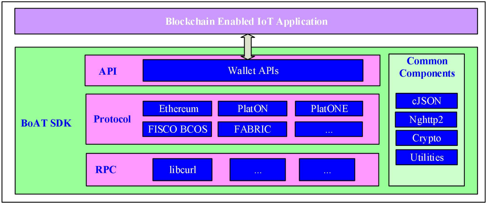

# BoAT User Guide

## Introduction

### Overview
This article introduces the functions and usage of BoAT IoT Framework SDK 2.x.  
The intended readers of this guide are customers who integrate the BoAT IoT Framework SDK.

### Abbreviated Terms
|Term |Explanation                                |
|:--- |:----------------------------------------- |
|ABI  |Application Binary Interface               |
|API  |Application Programming Interface          |
|BoAT |Blockchain of AI Things                    |
|IoT  |Internet of Things                         |
|JSON |JavaScript Object Notation                 |
|OS   |Operating System                           |
|RLP  |Recursive Length Prefix (Encoding/Decoding)|
|RPC  |Remote Procedure Call                      |
|RTOS |Real Time Operating System                 |
|SDK  |Software Development Kit                   |
|WASM |WebAssembly                                |


## Function and Architecture
BoAT IoT Framework is a C language blockchain client framework software for cellular modules, which is easy to be ported to various modules and helps IoT applications based on cellular modules connect to the blockchain and access on-chain services. The functions provided by the BoAT IoT Framework SDK to IoT applications include initiating on-chain transactions, automatic generation of smart contract C interface code, calling smart contracts, and managing blockchain keys.

**Supported blockchain:**  
Ethereum<br>
PlatON<br>
PlatONE<br>
FISCO-BCOS<br>
Hyperledger Fabric<br>
Huawei BCS<br>

**Supported Target Operating System:**  
Linux<br>
RTOS<br>

**Supported Build Operating System:**  
Linux/Cygwin  

**Main features:**  
Blockchain account (wallet) parameter configuration  
Blockchain key pair generation  
Blockchain account creation/loading/unloading  
Transfer transaction  
Smart contract call (automatically generate C call interface)  
Smart contract call (manual construction)  


 ### Position in The System
 BoAT IoT Framework runs on the application processor of the cellular module in the form of a software lib library. The SDK is provided in the form of C source files and compiled in the development environment of the cellular module.

 For the cellular module in the form of OpenCPU, the BoAT IoT Framework library is linked by the IoT Application to form an IoT application with blockchain link capabilities.

 Figure 2-1 shows the position of BoAT IoT Framework in the OpenCPU module. As an application layer protocol, BoAT is located above the existing protocol stack of the module and provides blockchain services to IoT Application. The peer layer of BoAT is a blockchain network.  

 
 Figure 2-1 BoAT System Location

 For non-OpenCPU cellular modules, the BoAT IoT Framework library is linked by the module firmware and expanded into AT commands by the module manufacturer for invocation of IoT applications on the host computer, no longer repeated.

 ### BoAT IoT Framework SDK Architecture
 BoAT IoT Framework SDK is shown in Figure 2-2, which mainly includes Wallet API, blockchain client interface protocol, remote procedure call interface, common components, hardware dependent components and tool components.  

 
 Figure 2-2 BoAT Architecture

* The *Wallet API* is an interface that the SDK provides to the IoT Application to call, including the SDK public interface and wallet and transaction interfaces for different blockchain protocols.  

* The *Blockchain Client Interface Protocol* mainly implements transaction interface protocols for different blockchains, and interacts with blockchain nodes through the RPC interface.  

* The *Remote Procedure Call(RPC) interface* implements a warpper for different communication protocols. This component needs to be ported according to the specific communication method supported by the IoT device.  

* *Public Components* implement common functions such as RLP encoding, JSON codec, string processing, etc.  

* *Hardware Dependent Components* are ported components involving different hardware, such as cryptography accelerators, secure storage, random numbers, etc. This component needs to be ported according to specific hardware. The SDK also provides a set of default hardware dependent components with an implementation method that is software-based.  

* The *Tool Component* provides a set of  Python tools, which are used to generate C language contract call interface of smart contract ABI interface based on Solidity or WASM C++. 


 ### BoAT IoT Framework SDK Code Structure

````
<SDKRoot>
|
+---build           | Directory to store object and executable files
+---demo            | Demo application
+---docs            | API reference manual
+---vendor          | Special vendor dependency
|   \---common      |     Universal soft algorithms implementation
|   \---platform    |     Dependency of different platforms
+---include         | Header files for application to include
+---lib             | Lib files for application to link with
+---sdk             | SDK source
|   +---third-party |     Third party libraries
|   +---include     |     Header files for SDK internal use
|   +---protocol    |     Blockchain client protocol implementation
|   +---rlp         |     RLP encoder
|   +---utilities   |     Utility APIs
|   +---wallet      |     SDK entry API implementation
+---tests           | Test cases
+---tools           | Tools for generating C interface from contract ABI
````


*Note: The `build` and `lib` directories are generated during compilation. After the compilation is complete, only the `include`, `lib` in the first level directory, and the header file of `boatconfig.h` (located in the `vendor/platform/include` path) automatically generated after compilation is required by the application.*

## BoAT IoT Framework SDK Compilation

### Software Dependency
BoAT IoT Framework SDK depends on the following software:

| Dependent software | requirements                                         | Build environment         | Target environment        |
| :----------------- | :--------------------------------------------------- | :------------------------ | :------------------------ |
| Host OS            | Linux，Or Cygwin on Windows                          | Required                  |                           |
| Target OS          | Linux                                                |                           | Required                  |
| Compiler           | gcc，Need to support c99 (9.3.0 is tested)           | Required                  |                           |
| Cross-compiler     | arm-oe-linux-gnueabi-gcc (4.9.2 is tested)           | Required                  |                           |
| Make               | GNU Make (4.3 is tested)                             | Required                  |                           |
| Python             | Python 3.8.3 (Python 2.7 is also compatible)         | Required                  |                           |
| curl               | libcurl and its development files (7.55.1 is tested) | Required on Linux default | Required on Linux default |

Before compiling the SDK and using it, you need to make sure that these software have been installed. On Ubuntu, can use the apt install command to install the corresponding package. Under Cygwin, use the Setup program that comes with Cygwin to install.  
E.g.:
- Ubuntu
````
sudo apt install python
download curl-7.55.1.tar.xz : https://curl.se/download/curl-7.55.1.tar.xz
tar -xvf ./curl-7.55.1.tar.xz 
cd curl-7.55.1
./configure -enable-smtp -enable-pop3
make
sudo make install
sudo apt-get install libcurl4-openssl-dev
````
- Cygwin  

Execute setup-x86_64.exe and install tools including make, gcc, python, libcurl as shown below:


Under Windows, the SDK does not support compilation in environments other than Cygwin. If you must run outside of Cygwin (for example, a cross-compiler using Windows as the Build environment), please refer to [Use Windows as Compiler Environment](#Use-Windows-As-CompilerE-nvironment) chapter to adjust the compiled files.

When porting the SDK on RTOS, the libcurl dependency should be ported or the RPC method should be rewritten.

### Preparation for Compilation
#### BoAT IoT Framework SDK Source Path
In the save path of the SDK source code, starting from the root directory, the directory names at all levels should be composed of English letters, numbers, underscores or minus signs, and there should be no spaces, Chinese, and special symbols such as plus signs, @, and bracket.  

  

For example, the following is a suitable path:  
/home/developer/project-blockchain/boatiotsdk  
C:\Users\developer\Documents\project\boatiotsdk  

The following paths are not suitable:  
/home/developer/project+blockchain/boatiotsdk  
C:\Documents and Settings\developer\project\boatiotsdk  

If you can't avoid the unsuitable characters above in the path, please use the following methods to avoid:

For Linux: In a path without unsuitable characters, create a symbolic link to the SDK directory: ln -s \<SDKRoot\> boatiotsdk, and compile under the path of the symbolic link.  
For Windows: use the SUBST Z: \<SDKRoot\> command to create a virtual drive letter Z: (or other unused drive letter), and compile under the Z: drive.


#### Referenced External Environment Variables
Modify the environment variables in the following files of the SDK as needed:  
\<SDKRoot\>/vendor/platform/\<platform_name\>/external.env: Configure the external compilation environment dependency or the search path of the header file related to the hardware.  

During Host compilation, if gcc and binutils are already installed in the system, there is usually no need to modify these environment variable configurations.  
During cross compilation, if the cross compilation environment needs to configure a specific INCLUDE path, you need to add the path to the above file.  

#### BoAT IoT Framework SDK Configuration
- Enable/disable blockchain protocol
In the top-level makefile:

````
BOAT_PROTOCOL_USE_ETHEREUM  ?= 1
BOAT_PROTOCOL_USE_PLATON    ?= 1
BOAT_PROTOCOL_USE_PLATONE   ?= 1
BOAT_PROTOCOL_USE_FISCOBCOS ?= 1
BOAT_PROTOCOL_USE_HLFABRIC  ?= 1
BOAT_PROTOCOL_USE_HWBCS     ?= 1
````

As needed, change the value of the corresponding variable to `1` or `0` to enable or disable the corresponding blockchain protocol. Or while compiling the SDK, use make \<BOAT_PROTOCOL_USE_XXX\>=<1|0> to enable or disable the corresponding blockchain protocol.  
***Note：Since the PlatON, PlatONE, and FISCOBCOS blockchain wallet codes reuse the Ethereum wallet code in large numbers, it is necessary to enable Ethereum for any one of these three to be enabled.***  
***Note：Since the hw_bcs blockchain wallet codes reuse the fabric wallet code in large numbers, it is necessary to enable fabric for hw_bcs to be enabled.*** 
- Log printing level adjustment
If necessary, adjust the value of `BOAT_LOG_LEVEL` in the path \<SDKRoot\>/vendor/platform/\<platform_name\>/src/log/boatlog.h to adjust the printer type of the log.

### Automatic generation of contract C interface code
Smart contracts are executable codes on the blockchain, executed on blockchain virtual machines (such as EVM and WASM), and called by the client in the form of remote procedure calls (RPC).

Different virtual machines and contract programming languages have different application binary interfaces (ABI). When a client calls a contract function through RPC, it must follow the corresponding ABI assembly interface.

The SDK provides the following tools to generate the corresponding C interface code according to the contract ABI, so that in the C code, the smart contract on the chain can be called through the generated interface code like a general C function:  

|Conversion tool                        |use                                                                  |
|:------------------------------------- |:------------------------------------------------------------------- |
|\<SDKRoot\>/tools/eth2c.py             |According to the ABI of Ethereum Solidity, generate C calling code   |
|\<SDKRoot\>/tools/fiscobcos2c.py       |According to the ABI of FISCO-BCOS Solidity, generate C calling code |
|\<SDKRoot\>/tools/platoneSolidity2c.py |Generate C calling code according to PlatONE (Solidity) ABI          |
|\<SDKRoot\>/tools/platoneWASM2c.py     |Generate C calling code according to PlatONE (WASM) ABI              |

Contract programming languages generally support "object-oriented". However, since C language does not support "object-oriented" and cannot use a unified paradigm to transfer objects, only contract functions whose parameter types are consistent with the built-in types of C language can be converted into C calling code by tools. The specific input types of support contract functions are described in the [Contract Call (Automatically Generated)](#Contract-Call-(automatically-generated)) chapter.

Before making the call, you first need to compile the contract, and copy the ABI interface description JSON file generated in the contract compilation to the corresponding directory of the SDK: 

|Contract ABI storage path                            |use                                                           |
|:--------------------------------------------------- |:------------------------------------------------------------ |
|\<SDKRoot\>/demo/demo_ethereum/demo_contract         |Copy the ABI JSON file of Ethereum Solidity to this directory |
|\<SDKRoot\>/demo/demo_fiscobcos/demo_contract        |Copy the ABI JSON file of FISCO-BCOS to this directory        |
|\<SDKRoot\>/demo/demo_platone/demo_contract\Solidity |Copy PlatONE (Solidity) ABI JSON file to this directory       |
|\<SDKRoot\>/demo/demo_platone/demo_contract\WASM     |Copy PlatONE (WASM) ABI JSON file to this directory           |

*Note: ABI's JSON file must have ".json" as the file name suffix.*  

During the demo compilation process, the automatic generation tool will generate the corresponding C interface calling code according to the contract ABI JSON file. If the automatic generation of C interface fails during compilation, you need to delete the unsupported ABI JSON file (or delete the unsupported interface) from the corresponding directory of \<SDKRoot\>/contract, write the C code manually, and assemble the ABI interface. For details, please refer to the [Transfer Call](#Transfer-Call) chapter.
### Host Compilation
Host compilation means that the compilation environment is consistent with the target environment, for example, to compile x86 programs on x86. There are usually two scenarios for using Host compilation: 
1. In the software commissioning phase, the software functions are tested on the PC.
2. The target software itself runs on devices based on x86/x86-64 processors, such as some edge gateways.

#### Use Linux as The Compilation Environment
Compile Host based on Linux distribution (such as Ubuntu). Generally, there is no need to configure the compilation environment, just make sure that the dependent software has been installed.  
Follow the steps below to compile:

1. Store the SDK source code in a path that meets the requirements of [SDK source code path](#SDK-Source-Code-Path).
2. Optional: Put the ABI JSON file of the smart contract to be called in the corresponding directory of \<SDKRoot\>/demo/demo_\<protocol\>/demo_contract (see section 3.3).
3. In the \<SDKRoot\> directory, execute the following command:  
````
$make boatlibs
````
After the compilation is complete, the generated library file is in ./lib. The application should include the header files under ./include and link the libraries under ./lib to achieve the function of accessing the blockchain. See [Header Files and Libraries](#Header-Files-and-Libraries)chapter.

#### Use Cygwin as The Compilation Environment
On Windows, the SDK does not support compilation in environments other than Cygwin, nor does it support compilation with compilers other than gcc.

The compilation steps are the same as under Linux.

### Cross-Compilation
In cross-compilation, it is generally necessary to configure the compilation configuration file according to the specific compilation environment.

#### Use Linux as The Compilation Environment
##### Independent Cross-Compilation Environment
Independent compilation environment means that arm-oe-linux-gnueabi-gcc (or similar cross-compiler) has been installed in the Linux system and can be called independently.

The SDK requires at least the following environment variables to be set in the system to point to the cross-compilation environment:  

|Environment variable  |Description                                     |
|:-------------------- |:---------------------------------------------- |
|CC                    |Point to the cross compiler gcc executable file |
|AR                    |Point to the cross compiler ar executable file  |


When the environment variables of CC and AR are not defined in the environment, GNU make will default CC=cc and AR=ar. Usually, the gcc and bintuils compilation environment of the host are installed in the Linux system. Therefore, if the above environment variables are not defined, the host compilation will be executed.

When configuring a cross-compilation environment, it is usually necessary to execute a specific shell script to set the above environment variables to point to the cross-compilation environment. For the bash shell, commands similar to the following are usually executed:  

````
$source cross_compiler_config.sh  
````

or  

````
$. cross_compiler_config.sh 
````

The `cross_compiler_config.sh` in the above example is not a script in this SDK, but a configuration script in the cross-compilation environment. For the specific name and location, please refer to the relevant instructions of the cross-compilation environment.  
The `source` or `.` in the example is necessary, which makes the script execute in the context of the current shell, so the modification of environment variables in this script can only take effect in the current shell.

You can execute the following command to view the environment variable settings in the current shell:  
````
$export
````
If the environment variables CC and AR have been set, you can execute the following command to view the current version of CC and AR to confirm whether the desired cross-compilation environment has been pointed to:  
````
${CC} -v  
${AR} -v  
````
After the above configuration is completed, follow the steps in the chapter [Using Linux as the Compiling Environment](#Using-Linux-as-The-Compiling-Environment) chapter to compile.

##### A Cross-Compilation Environment Integrated with The Module Development Environment
Some OpenCPU modules have integrated a supporting cross-compiler environment in the development environment provided by them, so that customers do not need to install a cross-compiler separately in the Linux system. This is especially convenient for developing application software on multiple modules of different models on a host computer without repeatedly switching the cross-compilation environment.

###### The Module Development Environment is Compiled with GNU Make
If the module development environment uses GNU make as the compilation project (makefiles in the source code directories at all levels), you can adjust the compilation configuration for the BoAT IoT Framework SDK and incorporate it into the integrated module development environment for compilation.  

Usually, the example of the customer code is provided in the module development environment, and the compilation configuration of the example code of the customer is included in the compilation system.First copy the \<SDKRoot\> directory (boatiotsdk is the directory name in the following example) to the source code in the module development environment, and then modify the Makefile in example directory, to add a target to compile BoAT IoT Framework SDK.  
E.g. :  
Assuming that in the original compilation environment, the Makefile of the example in customer source code is as follows:  

````
.PHNOY: all  
all:  
    $(CC) $(CFLAGS) example.c -o example.o 

clean:  
	-rm -rf example.o

Adjusted to:

.PHNOY: all boatiotsdkall boatiotsdkclean  
all: boatiotsdkall  
    $(CC) $(CFLAGS) example.c -o example.o 

clean: boatiotsdkclean    
	-rm -rf example.o  

boatiotsdkall:
	make -C boatiotsdk boatlibs

boatiotsdkclean:
	make -C boatiotsdk clean
````

Among them, boatiotsdk is the directory where the SDK is located, and the -C parameter after make specifies to enter the boatiotsdk directory and then compile according to Makefile.

*Note: In the Makefile, the command under target must start with a Tab (ASCII code 0x09), not a space.*

The above steps are only used to compile the SDK library. After the SDK library compilation completes, the compiled library needs to be integrated into the module development environment. See the [Header Files and Libraries](#Header-Files-and-Libraries) chapter for details.

###### The Module Development Environment is Compiled with Non-GNU Make
Since BoAT IoT Framework SDK uses GNU make as the compilation project, if the module development environment uses non-GNU Make compilation projects (such as Ninja, ant, etc.), or uses the automatic generation tools of the compilation project (such as automake, CMake), it cannot Compile the SDK directly in the module development environment.  

To compile the SDK in such a module development environment, you need to release the gcc and binutils compilation tools in the module development environment, and configure the environment variables described in the chapter [Independent cross-compilation environment](#Independent-Cross-Compilation-Environment) so that they can be called in the system, which is equivalent to independent cross-compilation Environment, and then compile the SDK.

#### Use Windows as The Compilation Environment
Under Windows, the SDK does not support compilation in environments other than Cygwin. If the cross compiler with Windows as the build environment can only be run outside Cygwin, the compilation environment and compilation configuration files should be adjusted.  
When cross-compiling outside of Cygwin, you still need to install Cygwin and adjust the Makefile.

###### Install Cygwin
The SDK compilation project relies on some Cygwin tools. The tools that need to be installed are as follows:

|Tools needed |use                                                                                                                                                            |
|:----------- |:------------------------------------------------------------------------------------------------------------------------------------------------------------- |
|find         |Cygwin's find.exe is needed to search the subdirectories to be compiled recursively. Windows comes with another FIND.EXE with the same name but completely different functions, which cannot be used. |
|rm           |Used to delete specified directories and files. The built-in RMDIR/RD and DEL commands of the Windows cmd shell can only be used to delete directories (trees) and files, respectively, and are not compatible with Cygwin's rm.exe in terms of syntax. |
|mkdir        |Used to create one or more levels of directories. The built-in MKDIR/MD commands of Windows cmd shell have the same function, but the syntax is not compatible. |
|GNU make     |You can install make in Cygwin, or you can compile GNU make based on a compiler on Windows (such as Microsoft Visual Studio). The latter does not depend on Cygwin. |

After installing Cygwin, you need to configure its path. Since some Cygwin tools that SDK compilation relies on have the same names as the Windows built-in tools, you must ensure that the relevant tools referenced in the compilation point to the Cygwin version.

First, in the cmd shell that executes the compilation, execute the following command to increase the search path of Cygwin:  

````
set PATH=%PATH%;\<Path_to_Cygwin\>\bin 
````


Where \<Path_to_Cygwin\> is the absolute path of the Cygwin installation directory, such as: C:\Cygwin64  

<font color=grey>*Note: The above commands can be written in a bat batch file, or directly added to the Windows system environment variables for easy calling. Note that if you directly add the Windows system environment variables, you must not place Cygwin before the %SystemRoot%\System32 path, otherwise the find version of Cygwin will be called by mistake when calling the FIND command of Windows in other scenarios, which will affect other scenarios Use Windows built-in commands.*  

Then, modify `<SDKRoot>/vendor/platform/<platform_name>/external.env`, add the path to the dependent tool:

# Commands
````
CYGWIN_BASE := C:\cygwin64  # Modify to actual path to Cygwin
BOAT_RM := $(CYGWIN_BASE)\bin\rm -rf
BOAT_MKDIR := $(CYGWIN_BASE)\bin\mkdir
BOAT_FIND := $(CYGWIN_BASE)\bin\find
````

Taking Windows 10 as an example, the method to add the search path to the Windows environment variable is:  
a)	Right-click on the Windows logo menu and select "System"  
b)	Click "System Information" on the "About" page  
c)	Click "Advanced System Settings" on the "System" page  
d)	Click "Environment Variables" in the "System Properties" page  
e)	Click "Path" in "System Variables" on the "Environment Variables" page, and click "Edit"  
f)	On the "Edit Environment Variables" page, click "New", add the bin path under the Cygwin installation directory, and make sure that the new path is located anywhere after the path %SystemRoot%\system32  


###### Other adjustments
When cross-compiling outside of Cygwin, in addition to the previous section, the following adjustments are required:

1.	Try make, if it prompts that the path is wrong, change the corresponding path separator in the Makefile from "/" to "\\". Don't change all "/" to "\\" at the beginning, because the Windows version of some tools derived from Linux can recognize "/" as a path separator.
2.	Configure the environment variables described in section [Independent Cross-Compilation Environment](#Independent-Cross-Compilation-Environment) to point to the correct cross-compilation environment. In these environment variables, the path should be separated by "\\".

### Compile and Run Demo
#### Ready
SDK provides Demo based on Ethereum, PlatON, PlatONE, FISCO-BCOS, Hyperledger Fabric and HW-BCS. Before running these demos, the corresponding blockchain node software is need to installed(or have known nodes) and deploy the smart contracts required by the demo.  

The smart contract used by the demo and its ABI JSON file are placed in:  

|Demo smart contract                                          |Contract ABI JSON file                                        |use             |
|:----------------------------------------------------------- |:------------------------------------------------------------ |:-------------- |
|\<SDKRoot\>/demo/demo_ethereum/demo_contract/StoreRead.sol   |\<SDKRoot\>/demo/demo_ethereum/demo_contract/StoreRead.json   |Ethereum demo   |
|\<SDKRoot\>/demo/demo_platone/demo_contract/WASM/my_contract.cpp    |\<SDKRoot\>/demo/demo_platone/demo_contract/WASM/my_contract.cpp.abi.json    |PlatONE demo    |
|\<SDKRoot\>/demo/demo_fiscobcos/demo_contract/HelloWorld.sol |\<SDKRoot\>/demo/demo_fiscobcos/demo_contract/HelloWorld.json |FISCO-BCOS demo |


Before running Ethereum's Demo, you need to install the Ethereum node simulator ganache, as well as the Ethereum smart contract compilation deployment tool truffle, could visit this website: https://truffleframework.com  .
	
Ganache has a ganache-cli version of the command line interface, and a Ganache version of the graphical interface. The ganache-cli of the command line interface and the Ganache 1.x version of the graphical interface will not be saved. If the process of ganache-cli or Ganache 1.x is terminated, the deployed contract will be lost. The command truffle migrate - reset Redeploy the contract, the address of the redeployed contract may change. The Ganache 2.x version of the graphical interface can create a Workspace save state. After closing and reopening the Workspace next time, the deployed contract still does not need to be redeployed.  
In addition to using the ganache simulator, you can also use the Ethereum test network such as Ropsten (you need to apply for a free test token).  

Before running the PlatON Demo, the PlatON node need to be installed. The specific process can be referred to this website: https://platon.network/  .  

Before running the PlatONE Demo, you need to install the PlatONE node, as well as smart contract compilation and deployment tools,could visit this website: https://platone.wxblockchain.com  .

Before running the FISCO-BCOS Demo, you need to install the FISCO-BCOS node and contract deployment.
FISCO-BCOS source code and installation and deployment steps can visit this website: https://fisco-bcos-documentation.readthedocs.io

After completing the node (or simulator) deployment, you need to follow the instructions on the relevant websites to deploy the Demo smart contract. After the smart contract is successfully deployed, the contract address will be generated.

The Demo C code that calls the smart contract is placed in:  

|Demo C code                                                 |use                             |
|:---------------------------------------------------------- |:------------------------------ |
|\<SDKRoot\>/demo/demo_ethereum/demo_ethereum_storeread.c    |Ethereum demo use case          |
|\<SDKRoot\>/demo/demo_ethereum/demo_ethereum_transfer.c     |Ethereum transfer demo use case |
|\<SDKRoot\>/demo/demo_platon/demo_platon_transfer.c         |PLATON transfer demo use case   |
|\<SDKRoot\>/demo/demo_platone/demo_platone_mycontract.c     |PLATONE demo use case           |
|\<SDKRoot\>/demo/demo_fiscobcos/demo_fiscobcos_helloworld.c |FISCO-BCOS demo use case        |
|\<SDKRoot\>/demo/demo_fabric/demo_fabric_abac.c             |FABRIC demo use case            |
|\<SDKRoot\>/demo/demo_hw_bcs/demo_hw_bcs.c                  |HW-BCS demo use case            |

Before compiling the Demo, you need to modify the following parts of the Demo C code:  
- For ETHEREUM, PLATON, FISCO-BCOS, PLATONE:  
	1. Search for `demoUrl` and fill in the node URL (including port) as the IP address and RPC port of the actual deployed node or simulator  
	2. If the demo needs to use the native private key, search for `native_demoKey` and set the client private key as:  
		- For ETHEREUM, set it to the private key of any account generated by ganache  
    - For PlatON, there is no need to modify the private key in the Demo  
		- For PlatONE, there is no need to modify the private key in the Demo  
		- For FISCO-BCOS, set it to the native format private key corresponding to the private key under <FISCO-BCOS_ROOT>/console/accounts  
	3. If the demo needs to use the native private key, search for `pkcs_demoKey` and set the client private key as:  
		- For Ethereum, set the PKCS format private key corresponding to the private key of any account generated by Ganache  
    - For PlatONE, there is no need to modify the private key in the Demo
		- For PlatONE, there is no need to modify the private key in the Demo  
		- For FISCO-BCOS, set it to the private key under <FISCO-BCOS_ROOT>/console/accounts  
	4. Search for `demoRecipientAddress` and modify it to the deployment address of the Demo contract.  
- For FABRIC:  
	1. Search for `fabric_client_demokey` and set the private key used by the client  
	2. Search for `fabric_client_democert` and set the certificate corresponding to the client private key  
	3. If TLS is enabled for the demo, search for `fabric_org1_tlsCert`, `fabric_org2_tlsCert`, `fabric_order_tlsCert`, and set the CA certificate chain  
	4. Search for `fabric_demo_order1_url`, `fabric_demo_endorser_peer0Org1_url`, `fabric_demo_endorser_peer1Org1_url`, `fabric_demo_endorser_peer0Org2_url`, `fabric_demo_endorser_peer1Org2_url`, and set the url address of the endorsement node and sorting node  
	5. If TLS is enabled in the demo, search for `fabric_demo_order1_hostName`, `fabric_demo_endorser_peer0Org1_hostName`, `fabric_demo_endorser_peer1Org1_hostName`, `fabric_demo_endorser_peer0Org2_hostName`, `fabric_demo_endorser_peer1Org2_hostName` and set the host name of the node  
- For HW-BCS:  
	1. Search for `hw_bcs_client_demokey` and set the private key used by the client  
	2. Search for `hw_bcs_client_democert` and set the certificate corresponding to the client private key  
	3. If TLS is enabled for the demo, search for `hw_bcs_org1_tlsCert`, `hw_bcs_org2_tlsCert`, and set the CA certificate chain  
	4. Search for `hw_bcs_demo_endorser_peer0Org1_url`, `hw_bcs_demo_endorser_peer0Org2_url`, `hw_bcs_demo_order_url`, and set the url address of the endorsement node and sorting node  
	5. If TLS is enabled in the demo, search for `hw_bcs_demo_endorser_peer0Org1_hostName`, `hw_bcs_demo_endorser_peer0Org2_hostName`, `hw_bcs_demo_order_hostName`and set the host name of the node  

#### Compile Demo
Execute the following commands in the \<SDKRoot\> directory to compile the SDK call Demo:  
````
$make demo
````
The generated Demo programs are located under the path \<SDKRoot\>/build/demo/demo_\<protocol\>/<demo_name>, and the <protocol> can be `ethereum` `platon` `fisco-bcos` `platone` `fabric` `hwbcs`.


### Trouble Shooting in Compilation
1.  A message similar to "Makefile: 120: *** missing delimiter. Stop" is prompted during compilation.  
This problem is generally caused by the command under target in the Makefile that does not start with Tab (ASCII code 0x09). Note that when you press the Tab key, the text editor may replace the Tab character with a number of spaces. The text editor should be set not to replace Tab with spaces.

2. The prompt "curl/curl.h" cannot be found during compilation  
This problem is caused by the fact that curl and its development files are not installed in the system. For Host compilation on a Linux distribution, please note that only installing the curl package is not enough, you also need to install its development file package. The development file package has different names in different Linux distributions, usually named similar to curl-devel, or libcurl. For details, please refer to the package management tool of the Linux distribution you are using.    


If curl is compiled with source code and is not installed in the system directory, you should specify its search path in external.env, and specify the path where the curl library is located when linking.  


In cross-compilation, pay special attention to the search path and library should point to the header files and libraries in the cross-compilation environment, and should not point to the path on the Host that executes the compilation.


3. When cross-compiling and linking, it prompts that the byte order, bit width or ELF format does not match  
This problem is usually because in cross-compilation, some libraries refer to the Host library, and the Obj file is generated by cross-compilation, or some libraries are 32-bit and the other is 64-bit. You should carefully check the paths of all libraries to avoid mixed links between Host and Target libraries, or libraries with different bit widths.  


You can use the following command to check whether the library file is the ARM version or the x86 version, and the bit width:  
$file \<lib or obj file name\>

4. The compilation prompts that the executable file could not be found, or that the parameters are incorrect  
Common tips:  
'make' is not an internal or external command, nor is it an executable program or batch file.  
mkdir… command syntax is incorrect.  
FIND: The parameter format is incorrect  


This problem is generally caused by compiling under Windows, but Cygwin is not installed, or the paths of BOAT_RM, BOAT_MKDIR, and BOAT_FIND are not correctly configured in the Makefile. Please refer to section [Use Windows as Compiler Environment](#Use-Windows-as-Compiler-Environment) to install Cygwin and configure Makefile.

## Programming Model

### Header Files and Libraries
After the BoAT IoT Framework SDK compile completed, the application can initiate blockchain transactions or call smart contracts through the SDK header files and libraries.

After the SDK is compiled, only the following files are needed for the application when compiling and linking:

- All header files under \<SDKRoot\>/include 
- All library files under \<SDKRoot\>/lib 
-\<SDKRoot\>/vendor/platform/include/boatconfig.h header file
- If automatically generated C interface code based on the contract ABI JSON file is used, the generated smart contract C interface code file should also be included

1. Refer to the SDK header file in the application

- Add \<SDKRoot\>/include to the header file search path of the application, or copy all header files under \<SDKRoot\>/include to the application header file directory.
- In the application header file search path, add \<SDKRoot\>/vendor/platform/include, or copy the boatconfig.h header file under \<SDKRoot\>/vendor/platform/include to the application header file directory .
- In the application-related C code, add the following header files:

   ````
   #include "boatiotsdk.h" //SDK entry header file
   #include "boatconfig.h" //SDK configuration header file
   ````

- The application does not need to include the other header file directories of the SDK into the search path.

If you use the automatically generated C interface code based on the contract ABI JSON file, you also need to include the generated smart contract C interface code header file, and add the generated `*.c` file to the application compilation script.

2. Link SDK library files in the application

-In the application link library, add two static libraries in \<SDKRoot\>/lib in turn:
   `libboatwallet.a`
   `libboatvendor.a`

-In the link library of the application, add the dynamic library of curl:
   `-lcurl`

For cross-compilation, you should ensure that the curl versions in the development environment are consistent with those in the target version operating environment.

### SDK Initialization and Destruction
Before calling the SDK, you must call BoatIotSdkInit() to initialize the global resources of the SDK:

````
BOAT_RESULT BoatIotSdkInit(void);
````

If the SDK is no longer needed, call BoatIotSdkDeInit() to release resources:

````
void BoatIotSdkDeInit(void);
````

### Blockchain Wallet Create/Load/Unload/Delete
A wallet is a collection of attributes of a blockchain account. These attributes include key attributes such as private keys and blockchain node URLs. Before initiating a transaction or invoking a smart contract, a wallet must be created or a previously saved wallet must be loaded.

#### Create and Load Wallet
The SDK supports two types of wallets: one-time wallets and persistent wallets.

One-time wallets are created temporarily when in use and only exist in memory; they become invalid after shutdown.
Persistent wallets will be persistently saved when they are created. After turning off and on again, the persistent wallet that has been created before can be loaded.

*Note: The persistence implementation method in <SDKRoot>/vendor/common/storage is for reference only. In commercial products, it is recommended to consider a more secure persistence method based on actual hardware capabilities.*

When creating and loading a wallet, you should always call BoatWalletCreate() in the same thread.

When creating a wallet, you need to pass in wallet configuration parameters according to the specific blockchain protocol. The function of creating a wallet is described as follows:

````
BSINT32 BoatWalletCreate(BoatProtocolType protocol_type,
                         const BCHAR *wallet_name_str,
                         const void *wallet_config_ptr,
                         BUINT32 wallet_config_size);
````

Parameters:

|parameter name     |Parameter Description                                                                                                                    |
|:----------------- |:--------------------------------------------------------------------------------------------------------------------------------------- |
|protocol_type      |The blockchain protocol. See boattypes.h for supported protocol.                                                                         |
|wallet_name_str    |A string of wallet name.<br>If the given \<wallet_name_str\> is NULL, a one-time wallet is created.<br>Otherwise a persistent wallet with the given name will be created or loaded. |
|wallet_config_ptr  |Configuration (e.g. crypto key) for the wallet.<br>The exact configuration definition is determinted by the specified \<protocol_type\>. |
|wallet_config_size |Size (in byte) of configuration specified by \<wallet_config_ptr\>.                                                                      |

**return value:**
This function returns the non-negative index of the loaded wallet.
It returns -1 if wallet creation fails.

Example(Internally generated private key):

````
BoatEthWallet *g_ethereum_wallet_ptr = NULL;
BoatEthWalletConfig wallet_config    = {0};

/* wallet_config value assignment */
wallet_config.prikeyCtx_config.prikey_genMode = BOAT_WALLET_PRIKEY_GENMODE_INTERNAL_GENERATION;
wallet_config.prikeyCtx_config.prikey_type    = BOAT_WALLET_PRIKEY_TYPE_SECP256K1;

wallet_config.chain_id             = 1;
wallet_config.eip155_compatibility = BOAT_FALSE;
strncpy(wallet_config.node_url_str, demoUrl, BOAT_ETH_NODE_URL_MAX_LEN - 1);

/* create ethereum wallet */
index = BoatWalletCreate( BOAT_PROTOCOL_ETHEREUM, "boateth.keystore", &wallet_config, sizeof(BoatEthWalletConfig) );
````

#### Unload Wallet
Unloading the wallet will unload the wallet from the memory. It will not delete the persistent wallet, but the persistent wallet cannot be used until it is loaded again.

````
void BoatWalletUnload(BSINT32 wallet_index);
````

Parameters:

|parameter name   |Parameter Description       |
|:--------------- |:-------------------------- |
|wallet_index     |The wallet index to unload. |


#### Delete Wallet
Deleting the wallet will delete the persistent wallet. If the wallet has been loaded before the deletion, the persistent wallet will become a one-time wallet, which can still be used before being unloaded.

````
void BoatWalletDelete(BCHAR *wallet_name_str);
````

Parameters:

|parameter name      |Parameter Description      |
|:------------------ |:------------------------- |
|wallet_name_str     |The wallet name to delete. |

### Key Generation
The key that needs to be configured when creating a wallet can be inputted externally or generated by the SDK，this is achieved by setting `prikeyCtx_config.prikey_genMode` to the corresponding value.

### Transfer Call
Token transfer from this account to other accounts (not all blockchain protocols support transfers).

Take Ethereum as an example:

````
BOAT_RESULT BoatEthTransfer(BoatEthTx *tx_ptr, BCHAR *value_hex_str);
````

Parameters:

|parameter name    |Parameter Description                                        |
|:---------------- |:----------------------------------------------------------- |
|tx_ptr            |Transaction pointer.                                         |
|value_hex_str     |A string representing the value (Unit: wei) to transfer, in HEX format like "0x89AB3C".<br>Note that decimal value is not accepted. If a decimal value such as "1234" is specified, it's treated as "0x1234". |

**return value:**
This function returns `BOAT_SUCCESS` if transfer is successful.
Otherwise it returns one of the error codes.

### Contract Call (Automatically Generated)

#### Restrictions on Automatically Generated Contracts
Since contract programming languages generally support object-oriented, and C language does not support object-oriented, and cannot use a unified paradigm to transfer objects, only contract functions whose parameter types are consistent with the built-in types of C language can be converted into C calling code by tools.

For contracts written by Solidity, the tool supports the following parameter types:
  - address
  - bool
  - uint8
  - uint16
  - uint32
  - uint64
  - uint128
  - uint256
  - int8
  - int16
  - int32
  - int64
  - int128
  - int256
  - bytes1
  - bytes2
  - bytes3
  - bytes4
  - bytes5
  - bytes6
  - bytes7
  - bytes8
  - bytes9
  - bytes10
  - bytes11
  - bytes12
  - bytes13
  - bytes14
  - bytes15
  - bytes16 
  - bytes17
  - bytes18
  - bytes19
  - bytes20
  - bytes21
  - bytes22
  - bytes23
  - bytes24
  - bytes25
  - bytes26
  - bytes27
  - bytes28
  - bytes29
  - bytes30
  - bytes31
  - bytes32
  - bytes
  - string
  - T[N] : N > 0, N is an integer, T is Any of the above types.
  - T[]  : T is Any of the above types except T[N].

For WASM contracts written in C++, the tool supports the following parameter types:
  - string
  - uint8
  - uint16
  - uint32
  - uint64
  - int8
  - int16
  - int32
  - int64
  - void

If the contract function contains unsupported parameter types, the automatic conversion tool will not be able to complete the conversion, and the contract must be written manually.

#### Automatically Generated Contract Call Interface
The successfully generated contract call interface is the following C function:

`BCHAR *<Contract ABI JSON file name >_< Contract function name>(<Wallet type> *tx_ptr, …);`

E.g. :

`BCHAR *StoreRead_saveList(BoatEthTx *tx_ptr, Bbytes32 newEvent);`

The first parameter of the calling interface is always the pointer of the initialized transaction object.

If the call is successful, the return value of the call interface is a string in JSON format.

*Note: The memory of the string is allocated inside the SDK. The application must copy the string to the memory allocated by the application for subsequent use, and must not modify the content of the returned string or save the pointer to the string for use.*

The contract function that changes the state of the blockchain refers to any function that changes the persistent storage information in the blockchain ledger. For example, functions that write and modify member variables in the contract are all contract functions that change the state of the blockchain.If a contract function only modifies the local variables in the function, but does not modify the contract member variables, then the contract function is a contract function that does not change the state of the blockchain.

In some contract programming languages, the two types of contract functions have a clear modifier difference on the prototype, while in other programming languages, there is no obvious mark. In the ABI, these two types of functions have different identifiers.

For example, take the following Ethereum Solidity contract as an example:

    contract StoreRead {
        bytes32[] eventList;
    
        function saveList(bytes32 newEvent) public {
            eventList.push(newEvent);
        }
    
        function readListLength() public view returns (uint32 length_) {
            length_ = uint32(eventList.length);
        }
    function readListByIndex(uint32 index) public view returns (bytes32 event_) {
        if (eventList.length > index) {
            event_ = eventList[index];
        }
    }


After the contract is compiled, the ABI corresponding to the three functions are described as follows:

````
"abi": [
    {
      "constant": false,
      "inputs": [
        {
          "name": "newEvent",
          "type": "bytes32"
        }
      ],
      "name": "saveList",
      "outputs": [],
      "payable": false,
      "stateMutability": "nonpayable",
      "type": "function",
      "signature": "0xe648ba32"
    },
    {
      "constant": true,
      "inputs": [],
      "name": "readListLength",
      "outputs": [
        {
          "name": "length_",
          "type": "uint32"
        }
      ],
      "payable": false,
      "stateMutability": "view",
      "type": "function",
      "signature": "0xd0a80818"
    },
    {
      "constant": true,
      "inputs": [
        {
          "name": "index",
          "type": "uint32"
        }
      ],
      "name": "readListByIndex",
      "outputs": [
        {
          "name": "event_",
          "type": "bytes32"
        }
      ],
      "payable": false,
      "stateMutability": "view",
      "type": "function",
      "signature": "0xaa1a7122"
    },
]
````

In the above contract, eventList is a member variable of the contract. saveList() will change the value of eventList, which is a contract function that changes the state of the blockchain; readListLength() and readListByIndex() fuction have a view modifier and only reads the value of eventList. It is a contract function that does not change the state of the blockchain.  

In particular, there are significant differences in the principles of invoking between smart contract functions that update the ledger and those who don’t, even though the two types of functions are quite similar in prototype. The same is true for the interface functions in C language generated through the conversion tool.

Any change to the state of the blockchain needs to be implemented through blockchain transaction and reach a consensus across the entire network. The contract function that changes the state of the blockchain is called asynchronously. When called, it merely initiates the blockchain transaction, and the contract is not executed until the blockchain network packages the transaction into a block. Take StoreRead demo as an example. The related calling code is as follows:  
```
  BCHAR *result_str;
  result_str = StoreRead_saveList(&tx_ctx, (BUINT8*)"HelloWorld");
```
The return value result_str obtained from the StoreRead_saveList function is only the hash value used to identify the transaction, not the return value of the StoreRead contract saveList function. Therefore, when designing a smart contract, the public interface function that changes the state of the blockchain, the information it tries to return should be stored in the contract member variable. To get the value of the changed blockchain, refer to the following code, where the "hash" is the hash of the transaction obtained in the previous step.  
```
  BUINT32 list_len;
  if (BOAT_SUCCESS == BoatEthGetTransactionReceipt(hash))
  {
    list_len = StoreRead_readListLength(&tx_ctx);
    result_str = StoreRead_readListByIndex(&tx_ctx, list_len - 1);
  }
```
When BoatEthGetTransactionReceipt (hash) return value is BOAT_SUCCESS, shows the state of the corresponding change block chain contract function call has been mined. Assume that the contract will only be changed by the user, and then get the length list_len of the eventList array from StoreRead_readListLength().The value "HelloWorld" is uploaded by StoreRead_saveList() through a call to StoreRead_readListByIndex().  

Contract functions that do not change the state of the blockchain, only need the blockchain node to read the existing information in its database, without transactions and consensus. So the call to this type of function is a synchronous call. The return value is the return value in the form of the contract function. The readListLength and readListByIndex functions of the StoreRead contract are such contract functions.

*Note: This code can only be pseudocode, in order to facilitate understanding, the return value needs to be converted accordingly. For details, see Demo_ethereum_Storeread.c.*

#### Transaction Initialization
To call the automatically generated contract interface, first initialize a transaction object, and then call the generated contract interface.  
Even if the called contract function does not change the state of the blockchain, a transaction object needs to be initialized first.

Take Ethereum as an example (different blockchain protocol parameters are different):

````
BOAT_RESULT BoatEthTxInit(BoatEthWallet *wallet_ptr,
                          BoatEthTx *tx_ptr,
                          BBOOL is_sync_tx,
                          BCHAR *gasprice_str,
                          BCHAR *gaslimit_str,
                          BCHAR *recipient_str)
````

Parameters:

|parameter name  |Parameter Description                                        |
|:-------------- |:----------------------------------------------------------- |
|wallet_ptr      |The wallet pointer that this transaction is combined with.   |
|tx_ptr          |Pointer a transaction object.                                |
|is_sync_tx      |For a stateful transaction, specify BOAT_TRUE to wait until the transaction is mined.<br>Specifiy BOAT_FALSE to allow multiple transactions to be sent continuously in a short time.<br>For a state-less contract call, this option is ignored. |
|gasprice        |A HEX string representing the gas price (unit: wei) to be used in the transaction.<br>Set \<gasprice\> = NULL to obtain gas price from network.<br>BoatEthTxSetGasPrice() can later be called to modify the gas price at any time before the transaction is executed. |
|gaslimit        |A HEX string representing the gas limit to be used in the transaction.<br>BoatEthTxSetGasLimit() can later be called to modify the gas limit at any time before the transaction is executed. |
|recipient_str   |A HEX string representing the recipient address, in HEX format like"0x19c91A4649654265823512a457D2c16981bB64F5".<br>BoatEthTxSetRecipient() can later be called to modify the recipient at any time before the transaction is executed. |

**return value:**
This function returns `BOAT_SUCCESS` if initialization is successful.
Otherwise it returns one of the error codes.

E.g. :

````
BoatEthTx tx_ctx;
BOAT_RESULT result;
result = BoatEthTxInit(wallet_ptr,
                       &tx_ctx,
                       BOAT_TRUE,
                       NULL,
                       "0x333333",
                       "0x9e7f3ae22cf97939a2e4cd68dd33bb29268a1ec9");
````

#### Call Contract Interface
After completing the transaction initialization, you can call the automatically generated contract interface:

E.g. :

```
BCHAR *result_str;
result_str = StoreRead_saveList(&tx_ctx, (BUINT8 *)"HelloWorld");
```
#### Frequently Asked Questions
**Q:The following error is reported when compiling**
```
    for abi_item in self.abi_object['abi']:
TypeError: list indices must be integers, not str
```
A:The problem is caused by using the wrong input file. This input file should be the complete JSON file which is generated by the compiler. If just the contents of the ABI is copied and a JSON file is created, the ABI is need to add on the outermost layer. For specific format, please refer to:  
https://github.com/aitos-io/BoAT-X-Framework/issues/355


### Manually Construct Contract Calls
If the automatic generation tool cannot generate the C call interface, you need to manually construct the transaction message. In addition, because the Fabric and hwbcs invocation itself is so convenient that there is no need to use automatically generate interface tools, all contracts need to be invoked manually.

The manual construction of transactions needs to follow the ABI interface of the specific blockchain protocol.

**Example 1: Ethereum transaction structure**
- **Step 1** Call BoatEthTxInit() to initialize the transaction
- **Step 2** Set transaction parameters
  -Set transaction parameter nonce:

  ```
  BOAT_RESULT BoatEthTxSetNonce(BoatEthTx *tx_ptr, BUINT64 nonce);
  ```

  Nonce is usually set to BOAT_ETH_NONCE_AUTO, and the nonce value is obtained from the network.

  -If necessary, set the "value" parameter of the transaction(in the initialized transaction object, value defaults to 0):

  ```
  BOAT_RESULT BoatEthTxSetValue(BoatEthTx *tx_ptr, BoatFieldMax32B *value_ptr);
  ```
- **Step 3** For contract calls (transactions) that change the state of the blockchain, set the "data" parameter of the transaction:
  ```
  BOAT_RESULT BoatEthTxSetData(BoatEthTx *tx_ptr, BoatFieldVariable *data_ptr);
  ```
  Among them, the format of data_ptr follows the Ethereum ABI, including the first 4 bytes of the Keccak-256 hash of the contract function prototype as the Function Selector, and then the parameters are arranged in sequence:
  <https://solidity.readthedocs.io/en/develop/abi-spec.html>

- **Step 4** Send transaction
  - For contract calls that change the state of the blockchain, the following contract functions are called:
  ```
  BOAT_RESULT BoatEthTxSend(BoatEthTx *tx_ptr);
  ```

  - For contract calls that do not change the state of the blockchain, call the State-less contract function
  ```
  BCHAR *BoatEthCallContractFunc(BoatEthTx *tx_ptr,
                                  BCHAR *func_proto_str,
                                  BUINT8 *func_param_ptr,
                                  BUINT32 func_param_len);
  ```
  Among them, the format of func_param_ptr follows the same rules as Step 3.

**Example 2: PlatONE transaction structure
- **Step 1** Call BoatPlatONETxInit() to initialize the transaction, and the transaction type field is set according to the actual transaction type.

- **Step 2** Set transaction parameter:
  ```
  BOAT_RESULT BoatPlatoneTxSetNonce(BoatEthTx *tx_ptr, BUINT64 nonce); 
  ```
  The nonce is usually set to BOAT_PLATONE_NONCE_AUTO, and the nonce value is obtained from the network.

  - If necessary, set the "value" parameter of the transaction (in the initialized transaction object, value defaults to 0):
  ```
  BOAT_RESULT BoatPlatoneTxSetValue(BoatEthTx *tx_ptr, BoatFieldMax32B *value_ptr);
  ```
- **Step 3** For contract calls (transactions) that change the state of the blockchain, set the "data" parameter of the transaction:
  ```
  BOAT_RESULT BoatPlatoneTxSetData(BoatEthTx *tx_ptr, BoatFieldVariable *data_ptr);
  ```
  Among them, data_ptr is coded according to RLP and is sequentially compiled into the following fields:
  ```
  {
    TransactionType (Fixed unsigned 64bit, BigEndian),
    FunctionName,
    FunctionArgument1,
    FunctionArgument2,
  …
  }
  ```
  RLP encoding is as follows:
  - a) Call RlpInitListObject() to initialize the top-level LIST object
  - b) Call RlpInitStringObject() to initialize the first encoding field object
  - c) Call RlpEncoderAppendObjectToList() to add the first encoding field object to the top-level LIST object
  - d) Repeat b and c until all code objects are added to the top LIST object
  - e) Call RlpEncode() to perform RLP encoding on the top-level LIST object and its subobjects
  - f) Call RlpGetEncodedStream() to get the encoded stream
  - g) After completing the contract call, call RlpRecursiveDeleteObject() to destroy the top-level LIST object and all its child objects

- **Step 4** Send transaction
  - For contract calls that change the state of the blockchain, the following contract functions are called:
  ```
  BOAT_RESULT BoatPlatoneTxSend(BoatEthTx *tx_ptr);
  ```

  - For contract calls that do not change the state of the blockchain, call the State-less contract function
  ```
  BCHAR *BoatPlatoneCallContractFunc(BoatPlatoneTx *tx_ptr,
                                      BUINT8 *rlp_param_ptr,
                                      BUINT32 rlp_param_len)
  ```
  Among them, the format of rlp_param_ptr follows the same rules as Step 3.


  For the specific calling method, please refer to the automatically generated code of the Demo attached to the SDK, which is located under \<SDKRoot\>/contract/generated.

**Example 3: Hyperledger Fabric transaction structure**  
- **Step 1** Call BoatHlfabricTxInit() to initialize the transaction, The parameters are set based on actual usage.  

- **Step 2** If the node discovery function is not turned on,call BoatHlfabricWalletSetNetworkInfo() to set the newwork parameters. 
  
- **Step 3** Call BoatHlfabricTxSetTimestamp() to set timestamp, The real-time is obtained based on hardware functions.

- **Step 4** If the node discovery function is turned on,call BoatHlfabricDiscoverySubmit() to get all the nodes information on current chain. 

- **Step 5** Set trasaction parameters.  
  Examples of using demo_fabric_abac.c code:  
  ```
  result = BoatHlfabricTxSetArgs(&tx_ptr, "invoke", "a", "b", "10", NULL);
  ```  
  All function call of Fabric's input data are string. In the above code, "invoke" is the function name in the ABAC chain code. "a", "b", and "10" are the corresponding three inputs to the function. Regardless of the type of the corresponding variable in the chain code, the shape of string is used as the input.This is why there is no need to use automatically generate the contract interface tool.  

- **Step 6** Send the transaction.  
  - For contract calls that change the state of the blockchain, call the BoatHlfabricTxSubmit function：
    ```
    BOAT_RESULT BoatHlfabricTxSubmit(BoatHlfabricTx *tx_ptr);
    ```

  - For contract calls that do not change the state of the blockchain, call the BoatHlfabricTxEvaluate contract function：
    ```
    BOAT_RESULT BoatHlfabricTxEvaluate(BoatHlfabricTx *tx_ptr);
    ```
  When the return result is BOAT_SUCCESS, the call succeeds。

**Example 4: HW BCS transaction structure**  
- **Step 1** Call BoatHwbcsTxInit() to initialize the transaction, The parameters are set based on actual usage.  

- **Step 2** Call BoatHwbcsWalletSetNetworkInfo() to set the newwork parameters. 
  
- **Step 3** Call BoatHwbcsTxSetTimestamp() to set timestamp, The real-time is obtained based on hardware functions.

- **Step 4** Set trasaction parameters.  
  Examples of using demo_hw_bcs.c code:  
  ```
  result = BoatHwbcsTxSetArgs(&tx_ptr, "initMarble", "a","1" , NULL, NULL);
  ```  
  All function call of Hwbcs's input data are string. In the above code, "initMarble" is the function name in the hw chain code. "a", "1" are the corresponding two inputs to the function. Regardless of the type of the corresponding variable in the chain code, the shape of string is used as the input.This is why there is no need to use automatically generate the contract interface tool.  

- **Step 5** Send the transaction.  
  - For contract calls that change the state of the blockchain, call the BoatHwbcsTxSubmit function：
    ```
    BOAT_RESULT BoatHwbcsTxSubmit(BoatHwbcsTx *tx_ptr)
    ```

  - For contract calls that do not change the state of the blockchain, call the BoatHwbcsTxEvaluate contract function：
    ```
    BOAT_RESULT BoatHwbcsTxEvaluate(BoatHwbcsTx *tx_ptr);
    ```
  When the return result is BOAT_SUCCESS, the call succeeds。


## Suggestions for Porting SDK to RTOS
If the SDK is ported to RTOS, the following points should generally be followed:
###### 1. Remove The Dependency On Curl

curl is a communication protocol library under Linux, used in the SDK to support http/https communication. Blockchain nodes usually use the http/https protocol to communicate.

For modules using RTOS, you should add a call package to the module's http/https interface in\<SDKRoot\>/vendor/platform/\<platform_name\>/src/rpc, and modify \<SDKRoot\>/vendor/platform/\<platform_name\>/scripts/gen.py, close RPC_USE_LIBCURL and set the new RPC USE OPTION.


###### 2. Remove Dependence on The File System

The SDK uses files as a persistent storage method for the wallet. If the RTOS does not support the file system, you should modify the file operation related to  `BoatGetFileSize` , `BoatWriteFile` , `BoatReadFile` , `BoatRemoveFile` ,from \<SDKRoot\>/vendor/platform/\<platform_name\>/port_xx/boatplatform_internal.c, modify the read/write file to the persistence method supported by the system.

###### 3. Memory Trimming

If the memory of the target system is too tight to load, you can try to trim the memory. The points that can be cropped include:

a) According to actual needs, in \<SDKRoot\>/makefile, close the blockchain protocol that does not need to be supported
b) According to the actual situation, reduce the storage space BOAT_XXX_NODE_URL_MAX_LEN of the node URL string in \<SDKRoot\>/api_\<protocol\>.h
c) According to actual needs, reduce the number of wallets BOAT_MAX_WALLET_NUM in \<SDKRoot\>/include/boatwallet.h
d) According to the actual situation, reduce the maximum number of members supported in a LIST in \<SDKRoot\>/include/boatrlp.h MAX_RLP_LIST_DESC_NUM
e) According to the actual situation, reduce the self-increment step size of web3 data buffer in <SDKRoot>/sdk/protocol/common/web3intf/web3intf.h WEB3_STRING_BUF_STEP_SIZE


###### If After The Above Cropping, The Memory is Still Too Large To Fit, Please Try:
- a) According to actual needs, the simple RLP encoding method for specific transaction parameters is used to replace the recursive general RLP encoding method in \<SDKRoot\>/sdk/rlp
- b) According to actual needs, tailor the APIs that are not actually used

## BoAT's Extended AT Command Suggestion

### Create/Load Wallet AT^BCWALT
|Command                                                                         |Response(s)                                               |
|:------------------------------------------------------------------------------ |:-------------------------------------------------------- |
|Write Command:<br>^BCWALT=\<protocol_type\>,\<wallet_name\>[,\<wallet_config\>] |^BCWALT: \<wallet_index\><br>OK<br>                       |
|Test Command:<br>^BCWALT=?                                                      |+BCWALT: (list of supported \<protocol_type\>s)<br>OK<br> |

Features:
Create/load wallet, corresponding to BoatWalletCreate().

Parameters:
\<protocol_type\>: integer type
- 1: Ethereum
- 2: Hyper Ledger Fabric (not yet supported)
- 3: PlatON
- 4: PlatONE

\<wallet_name\>: string type; 
a string of wallet name

\<wallet_config\>: string type;
A JSON string representing the wallet configuration of \<protocol_type\>. The exact format is manufacture specific.

\<wallet_index\>: integer type; 
the index of the created wallet

### Unload Wallet AT^BUWALT
|Command                                  |Response(s)                                             |
|:--------------------------------------- |:------------------------------------------------------ |
|Write Command:<br>^BUWALT=<wallet_index> |<br>OK<br>                                              |
|Test Command:<br>^BUWALT=?               |+BUWALT: (list of loadeded \<wallet_index\>s)<br>OK<br> |

Features:
Unload wallet，corresponding to BoatWalletUnload ().

Parameters:
\<wallet_index\>: integer type; wallet index to unload, previously returned by ^BCWALT
### Delete Wallet AT^BDWALT
|Command                                   |Response(s)  |
|:---------------------------------------- |:----------- |
|Write Command:<br>^BDWALT=\<wallet_name\> |<br>OK<br>   |

Features:
Delete the created persistent wallet, corresponding to BoatWalletDelete()。

Parameters:
\<wallet_name\>: string type; the name of the wallet to delete

### Contract Function Call AT^BCALLFUNC
|Command                                                     |Response(s)|
|:---------------------------------------------------------- |:--------- |
|Write Command:<br>^BCALLFUNC=\<wallet_index\>,\<tx_object\> |<br>OK<br> |

Features:
Initiating a contract call corresponds to the C call interface generated according to the contract ABI JSON file.

Parameters:
\<wallet_index\>: integer type; wallet index combined with the contract call, previously returned by ^BCWALT

\<tx_object\>: string type;
A JSON string representing the transaction object as per the generated C contract interface. The exact format is manufacture specific.

\<wallet_index\>: integer type; the index of the created wallet

### Transfer AT^BTRANS
|Command                                                            |Response(s)|
|:----------------------------------------------------------------- |:--------- |
|Write Command:<br>^BTRANS=\<wallet_index\>,\<recipient\>,\<value\> |<br>OK<br> |

Features:
Initiate a transfer of the designated Wallet (not all blockchains support transfers). For example, for Ethereum, it corresponds to BoatEthTransfer().

Parameters:
\<wallet_index\>: integer type; wallet index combined with the transfer (the payer), previously returned by ^BCWALT

\<recipient\>: string type;
A HEX string representing the recipient (payee) address.

\<value\>: integer type; the value to transfer, represented by the smallest token unit of the protocol (e.g. for Ethereum, the unit is wei or 10-18 ether).
## Reference
BoAT API Reference Manual

[1].BoAT IoT Framework SDK Reference Manual, AITOS.20.70.100IF, V1.0.0
