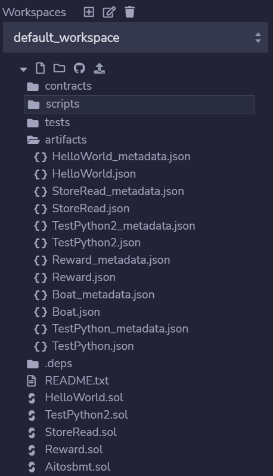

# Solidity接口生成工具使用说明

## 引言

### 概述

本文介绍由tools文件夹下Python脚本根据智能合约的JSON文件生成后的C语言函数各种参数调用方法。 
本文的预期读者为使用Solidity合约的客户。  

## 功能介绍

由于对链上部署好的Solidity合约调用需要将输入数据编码为指定的格式，编码过程非常复杂，所以提供便捷的自动转换的工具来帮助用户调用合约。具体Solidity输入编码方式参考[Solidity官方网站](https://docs.soliditylang.org/)，`Contract ABI Specification`章节

**已支持的区块链:**  
|区块链  |脚本名字                   |
|:-----  | :--------------          |
|以太坊  |eth2c.py                   |
|PlatONE  |platoneSolidity2c.py           |
|FISCO-BCOS  |fiscobcos2c.py  |
|Venachain  |venachainSolidity2c.py  |
|Quorum  |Quorum2c.py  |

## 软件依赖
@todo

## 使用说明
通过工具生成Solidity合约的C接口文件时，需要根据相应的平台调用tools文件夹相应的合约版本，其中，`eth2c.py`，`fiscobcos2c.py`，`platoneSolidity2c.py`，`venachainSolidity2c.py`和`Quorum2c.py`五个文件为相应链的合约脚本。  

### 输入文件生成

#### 从Remix获得json文件
当使用Remix编译合约时，编译完成后，不能从编译界面下面的ABI获得相关参数并手动生成JSON文件。而是应该从如下图4-1所示位置将相应的合约文件内容复制出来并手动在本地生成JSON文件。  
  
图 4-1 从Remix获得json文件  
#### 从truffle获得json文件
使用truffle对Solidity合约编译完成后会将相应的JSON文件生成在目录`\build\contracts`下。
### 输入类型转换
**已支持的Solidity变量:**  
|Solidity变量类型  |BoAT中映射的变量类型         | 
|:-----  | :--------------          | 
|  string      |BCHAR *    |
|  bytes       |BUINT8 *   |
|  bytes[]     |BoatFieldVariable*|
|  string[]    |BoatFieldVariable*|
|  address[]   |BoatAddress *|
|  bool[]      |BUINT8 *   |
|  uint8[]     |BUINT8 *   |
|  uint16[]    |BUINT16 *  |
|  uint32[]    |BUINT32 *  |
|  uint64[]    |BUINT64 *  |
|  uint128[]   |BUINT128 * |
|  uint256[]   |BUINT256 * |
|  int8[]      |BSINT8 *   |
|  int16[]     |BSINT16 *  |
|  int32[]     |BSINT32 *  |
|  int64[]     |BSINT64 *  |
|  int128[]    |BSINT128 * |
|  int256[]    |BSINT256 * |
|  bytes1[]    |Bbytes1 *  |
|  bytes2[]    |Bbytes2 *  |
|  bytes3[]    |Bbytes3 *  |
|  bytes4[]    |Bbytes4 *  |
|  bytes5[]    |Bbytes5 *  |
|  bytes6[]    |Bbytes6 *  |
|  bytes7[]    |Bbytes7 *  |
|  bytes8[]    |Bbytes8 *  |
|  bytes9[]    |Bbytes9 *  |
|  bytes10[]   |Bbytes10 * |
|  bytes11[]   |Bbytes11 * |
|  bytes12[]   |Bbytes12 * |
|  bytes13[]   |Bbytes13 * |
|  bytes14[]   |Bbytes14 * |
|  bytes15[]   |Bbytes15 * |
|  bytes16[]   |Bbytes16 * |
|  bytes17[]   |Bbytes17 * |
|  bytes18[]   |Bbytes18 * |
|  bytes19[]   |Bbytes19 * |
|  bytes20[]   |Bbytes20 * |
|  bytes21[]   |Bbytes21 * |
|  bytes22[]   |Bbytes22 * |
|  bytes23[]   |Bbytes23 * |
|  bytes24[]   |Bbytes24 * |
|  bytes25[]   |Bbytes25 * |
|  bytes26[]   |Bbytes26 * |
|  bytes27[]   |Bbytes27 * |
|  bytes28[]   |Bbytes28 * |
|  bytes29[]   |Bbytes29 * |
|  bytes30[]   |Bbytes30 * |
|  bytes31[]   |Bbytes31 * |
|  bytes32[]   |Bbytes32 * |
|  address     |BoatAddress|
|  bool        |BUINT8     |
|  uint8       |BUINT8     |
|  uint16      |BUINT16    |
|  uint32      |BUINT32    |
|  uint64      |BUINT64    |
|  uint128     |BUINT128   |
|  uint256     |BUINT256   |
|  int8        |BSINT8     |
|  int16       |BSINT16    |
|  int32       |BSINT32    |
|  int64       |BSINT64    |
|  int128      |BSINT128   |
|  int256      |BSINT256   |
|  bytes1      |Bbytes1    |
|  bytes2      |Bbytes2    |
|  bytes3      |Bbytes3    |
|  bytes4      |Bbytes4    |
|  bytes5      |Bbytes5    |
|  bytes6      |Bbytes6    |
|  bytes7      |Bbytes7    |
|  bytes8      |Bbytes8    |
|  bytes9      |Bbytes9    |
|  bytes10     |Bbytes10   |
|  bytes11     |Bbytes11   |
|  bytes12     |Bbytes12   |
|  bytes13     |Bbytes13   |
|  bytes14     |Bbytes14   |
|  bytes15     |Bbytes15   |
|  bytes16     |Bbytes16   |
|  bytes17     |Bbytes17   |
|  bytes18     |Bbytes18   |
|  bytes19     |Bbytes19   |
|  bytes20     |Bbytes20   |
|  bytes21     |Bbytes21   |
|  bytes22     |Bbytes22   |
|  bytes23     |Bbytes23   |
|  bytes24     |Bbytes24   |
|  bytes25     |Bbytes25   |
|  bytes26     |Bbytes26   |
|  bytes27     |Bbytes27   |
|  bytes28     |Bbytes28   |
|  bytes29     |Bbytes29   |
|  bytes30     |Bbytes30   |
|  bytes31     |Bbytes31   |
|  bytes32     |Bbytes32   |

```  
注意：
当合约使用u128、u256、s128和s256四种类型时，由于C语言不支持相应的类型，需要使用UINT8的数组拼接而成。而BUINT128, BUINT256, BSINT128和BSINT256采用小端模式，即是指数据的高字节保存在内存的高地址中，而数据的低字节保存在内存的低地址中。  

例如原数据为正数0x1234，放入BUINT128或BUINT256中时，data[0] = 0x34, data[1] = 0x12，其他赋值为0。

但是当原数据类型为BSINT128或BSINT256，且数据为负数时，相应的值为原码的补码并加一。当原数据为BSINT128且值为-1000时，相应的16进制表示为0xFFFF FFFF FFFF FFFF FFFF FFFF FFFF FC18,此时data[0] = 0x18, data[1] =0xFC，以此类推。BSINT256也是同样。
```  
以下例子中，生成的C语言函数均省去交易类型
#### string类型
Solidity中的string变成BCHAR *类型。  
Solidity函数：setName(string name);  
C语言函数：合约名_setName(BCHAR *name);  

示例：
```
const BCHAR *name = "Hello,World!";
合约名_setName(name);
```

#### bytes类型
Solidity中的bytes变成BUINT8 *类型和一个表示长度的BUINT32值  
Solidity函数：setData(bytes data);  
C语言函数：合约名_setData(BUINT8 *data, BUINT32 dataLen);  

示例：
```
BUINT8 data[] = {0,1,2,3,4,5};  
合约名_setData(data, 6);  
```

#### bytes[N]类型
其中N为大于0的整数。  
Solidity中的bytes[N]变成BoatFieldVariable *类型  
Solidity函数：setData(bytes[N] data);  
C语言函数：合约名_setData(BoatFieldVariable *data);  

示例：
```
BoatFieldVariable input[2];
BUINT8 data1[] = {0,1};
BUINT8 data2[] = {0,1,2,3,4,5};
input[0].field_ptr = data1;
input[0].field_len = 2;
input[1].field_ptr = data2;
input[1].field_len = 6;
合约名_setData(input); 
```

#### bytes[]类型
Solidity中的bytes[]变成BoatFieldVariable *类型和一个表示长度的BUINT32值  
Solidity函数：setData(bytes[] data);  
C语言函数：合约名_setData(BoatFieldVariable *data, BUINT32 dataLen);  

示例：
```
BoatFieldVariable input[3];
BUINT8 data1[] = {0,1};
BUINT8 data2[] = {0,1,2,3,4,5};
BUINT8 data3[] = {7,8,9,10,11,12,13,14};
input[0].field_ptr = data1;
input[0].field_len = 2;
input[1].field_ptr = data2;
input[1].field_len = 6;
input[2].field_ptr = data3;
input[2].field_len = 8;
合约名_setData(input, 3); 
```

#### string[N]类型
Solidity中的string[N]变成BoatFieldVariable *类型  
Solidity函数：setData(string[N] data);  
C语言函数：合约名_setData(BoatFieldVariable *data);  

示例：
```
BoatFieldVariable input[3];
BCHAR data1[] = {0x31, 0x32, 0x33, 0x34};
BCHAR data2[] = {'H','e','l','l','o',',','w','o','r','l','d','!'};
BCHAR data3[] = {0x39, 0x38, 0x37, 0x36, 0x35};

input[0].field_ptr = data1;
input[0].field_len = 4;
input[1].field_ptr = data2;
input[1].field_len = 12;
input[2].field_ptr = data3;
input[2].field_len = 5;
合约名_setData(input); 
```

#### string[]类型
Solidity中的string[]变成BoatFieldVariable *类型和一个表示长度的BUINT32值  
Solidity函数：setData(string[] data);  
C语言函数：合约名_setData(BoatFieldVariable *data, BUINT32 dataLen);  

示例：
```
BoatFieldVariable input[3];
BCHAR data1[] = {0x31, 0x32, 0x33, 0x34};
BCHAR data2[] = {'H','e','l','l','o',',','w','o','r','l','d','!'};
BCHAR data3[] = {0x39, 0x38, 0x37, 0x36, 0x35};

input[0].field_ptr = data1;
input[0].field_len = 4;
input[1].field_ptr = data2;
input[1].field_len = 12;
input[2].field_ptr = data3;
input[2].field_len = 5;
合约名_setData(input, 3); 
```

#### address[N]类型
Solidity中的address[N]变成BoatAddress *类型。  
Solidity函数：setData(address[N] data);  
C语言函数：合约名_setData(BoatAddress data[2]);  

示例：
```
BoatAddress data[2];
for (i = 0; i < 20; i++)
{
    data[0][i] = i;
    data[1][i] = 20 - i;
}
合约名_setData(data); 
```

#### address[]类型
Solidity中的address[]变成BoatAddress *类型和一个表示长度的BUINT32值。  
Solidity函数：setData(address[] data);  
C语言函数：合约名_setData(BoatAddress *data, BUINT32 dataLen);  

例如，拿以太坊地址0xA16502DDda899443eF54Ddd011eE39E1535c78dB作为输入举例。
示例：  
```
BoatAddress data[2];
for (i = 0; i < 20; i++)
{
    data[0][i] = i;
}
UtilityHexToBin(data[1], 20, "A16502DDda899443eF54Ddd011eE39E1535c78dB", TRIMBIN_TRIM_NO, BOAT_FALSE);
UtilityChangeEndian(data[1], 20);
合约名_setData(data, 2); 
```

***注意：对ADDRESS地址需要进行端序转换***

#### bool[N]类型
Solidity中的bool[N]变成BUINT8 *类型。  
Solidity函数：setData(bool[N] data);  
C语言函数：合约名_setData(BUINT8 *data);  

示例：
```
BUINT8 data[2];
data[0] = BOAT_FALSE;
data[1] = BOAT_TRUE;
合约名_setData(data); 
```

#### bool[]类型
Solidity中的bool[]变成BUINT8 *类型和一个表示长度的BUINT32值。  
Solidity函数：setData(bool[] data);  
C语言函数：合约名_setData(BUINT8 *data, BUINT32 dataLen);  

示例：  
```
BUINT8 data[3];
data[0] = BOAT_FALSE;
data[1] = BOAT_TRUE;
data[2] = BOAT_FALSE;
合约名_setData(data, 3); 
```

#### uint8[N]类型
Solidity中的uint8[N]变成BUINT8类型。  
Solidity函数：setData(uint8[N] data);  
C语言函数：合约名_setData(BUINT8 *data);  

示例：  
```
BUINT8 data[2];
data[0] = 0;
data[1] = 1;
合约名_setData(data); 
```

#### uint8[]类型
Solidity中的uint8[]变成BUINT8类型和一个表示长度的BUINT32值。  
Solidity函数：setData(uint8[] data);  
C语言函数：合约名_setData(BUINT8 *data, BUINT32 dataLen);  

示例：
```
BUINT8 data[3];
data[0] = 32;
data[1] = 10;
data[2] = 255;
合约名_setData(data, 3); 
```

#### uint16[N]类型
参考[uint8[N]类型](#uint8[n]类型)，只是需要把相应的BUINT8改为BUINT16。  

#### uint16[]类型
参考[uint8[]类型](#uint8[]类型)，只是需要把相应的BUINT8改为BUINT16。  

#### uint32[N]类型
参考[uint8[N]类型](#uint8[n]类型)，只是需要把相应的BUINT8改为BUINT32。  

#### uint32[]类型
参考[uint8[]类型](#uint8[]类型)，只是需要把相应的BUINT8改为BUINT32。  

#### uint64[N]类型
参考[uint8[N]类型](#uint8[n]类型)，只是需要把相应的BUINT8改为BUINT64。  

#### uint64[]类型
参考[uint8[]类型](#uint8[]类型)，只是需要把相应的BUINT8改为BUINT64。  

#### uint128[N]类型
Solidity中的uint128[N]变成BUINT128类型，而一个BUINT128是由BUINT8[16]组成的数组。  
Solidity函数：setData(uint128[N] data);  
C语言函数：合约名_setData(BUINT128 *data);  

示例：  
```
BUINT128 data[2];
BUINT32 i;
for (i = 0; i < 16; i++)
{
    data[0][i] = i;
    data[1][i] = (32 - i) * 2;
}
合约名_setData(data); 
```  

#### uint128[]类型
Solidity中的uint128[N]变成BUINT128类型和一个表示长度的BUINT32值。，而一个BUINT128是由BUINT8[16]组成的数组。  
Solidity函数：setData(uint128[] data);  
C语言函数：合约名_setData(BUINT128 *data, BUINT32 len);  

示例：  
```
BUINT128 data[2];
BUINT32 i;
for (i = 0; i < 16; i++)
{
    data[0][i] = i;
    data[1][i] = (32 - i) * 2;
}
合约名_setData(data, 2); 
``` 

#### uint256[N]类型
Solidity中的uint256[N]变成BUINT256类型，而一个BUINT256是由BUINT8[32]组成的数组。  
Solidity函数：setData(uint256[N] data);  
C语言函数：合约名_setData(BUINT256 *data);  

示例：  
```
BUINT256 data[3];
BUINT32 i;
for (i = 0; i < 32; i++)
{
    data[0][i] = i;
    data[1][i] = (32 - i) * 2;
    data[2][i] = (16 - i) * 4;
}
合约名_setData(data); 
```

#### uint256[]类型
Solidity中的uint256[N]变成BUINT256类型和一个表示长度的BUINT32值，而一个BUINT256是由BUINT8[32]组成的数组。  
Solidity函数：setData(uint256[] data);  
C语言函数：合约名_setData(BUINT256 *data, BUINT32 len);  

示例：  
```
BUINT256 data[2];
BUINT32 i;
for (i = 0; i < 32; i++)
{
    data[0][i] = i;
    data[1][i] = (32 - i) * 2;
}
合约名_setData(data, 2); 
``` 

#### int8[N]类型
参考[uint8[N]类型](#uint8[n]类型)，只是需要把相应的BUINT8改为BSINT8。    

#### int8[]类型
参考[uint8[]类型](#uint8[]类型)，只是需要把相应的BUINT8改为BSINT8。  

#### int16[N]类型
参考[uint8[N]类型](#uint8[n]类型)，只是需要把相应的BUINT8改为BSINT16。  

#### int16[]类型
参考[uint8[]类型](#uint8[]类型)，只是需要把相应的BUINT8改为BSINT16。  

#### int32[N]类型
参考[uint8[N]类型](#uint8[n]类型)，只是需要把相应的BUINT8改为BSINT32。  

#### int32[]类型
参考[uint8[]类型](#uint8[]类型)，只是需要把相应的BUINT8改为BSINT32。  

#### int64[N]类型
参考[uint8[N]类型](#uint8[n]类型)，只是需要把相应的BUINT8改为BSINT64。  

#### int64[]类型
参考[uint8[]类型](#uint8[]类型)，只是需要把相应的BUINT8改为BSINT64。  

#### int128[N]类型
参考[uint128[N]类型](#uint128[n]类型)，只是需要把相应的BUINT128改为BSINT128。 

#### int128[]类型
参考[uint128[]类型](#uint128[]类型)，只是需要把相应的BUINT128改为BSINT128。

#### int256[N]类型
参考[uint256[N]类型](#uint256[n]类型)，只是需要把相应的BUINT256改为BSINT256。 

#### int256[]类型
参考[uint256[]类型](#uint256[]类型)，只是需要把相应的BUINT256改为BSINT256。

#### bytesN[]类型
N的范围为1~32。Solidity中的bytesN[]变成BbytesN类型和一个表示长度的BUINT32值。而一个BbytesN是由BUINT8[N]组成的数组。  
Solidity函数：setData(bytes5[] data);  
C语言函数：合约名_setData(Bbytes5 *data, BUINT32 datalen);  

示例：  
```
Bbytes5 data[2];
BUINT32 i;
for (i = 0; i < 5; i++)
{
    data[0][i] = i;
    data[1][i] = (32 - i) * 2;
}
合约名_setData(data, 2); 
``` 

注意，bytesN类型不涉及到端序和正负值的问题。

#### bytesN[M]类型
N的范围为1~32。Solidity中的bytesN[]变成BbytesN类型和一个表示长度的BUINT32值。而一个BbytesN是由BUINT8[N]组成的数组。  
Solidity函数：setData(bytes5[] data);  
C语言函数：合约名_setData(Bbytes5 *data, BUINT32 datalen);  

示例：  
```
Bbytes5 data[2];
BUINT32 i;
for (i = 0; i < 5; i++)
{
    data[0][i] = i;
    data[1][i] = (32 - i) * 2;
}
合约名_setData(data, 2); 
``` 

***注意：bytesN类型不涉及到端序和正负值的问题。***

#### address类型
Solidity中的address变成BoatAddress类型。  
Solidity函数：setData(address data);  
C语言函数：合约名_setData(BoatAddress data);  

例如，拿以太坊地址0xA16502DDda899443eF54Ddd011eE39E1535c78dB作为输入举例。
示例：
```
BoatAddress address;
UtilityHexToBin(address, 20, "A16502DDda899443eF54Ddd011eE39E1535c78dB", TRIMBIN_TRIM_NO, BOAT_FALSE);
UtilityChangeEndian(address, 20);
result_str = 合约名_setData(address);
```

***注意：对ADDRESS地址需要进行端序转换***

#### bool类型
Solidity中的bool变成BUINT8类型即C语言中的unsigned char类型。  
Solidity函数：setData(bool data);  
C语言函数：合约名_setData(BUINT8 data);  
```
BUINT8 condition;
condition = BOAT_TRUE;
result_str = 合约名_setData(condition);
```

#### uint8类型
该类型具备C语言的对应类型，为BUINT8。剩下的参考bool类型。

#### uint16类型
该类型具备C语言的对应类型，为BUINT16。剩下的参考bool类型。

#### uint32类型
该类型具备C语言的对应类型，为BUINT32。剩下的参考bool类型。

#### uint64类型
该类型具备C语言的对应类型，为BUINT64。剩下的参考bool类型。

***注意：对于unsigned long long int为32位的运行环境，暂不能支持该类型***

#### uint128类型
Solidity中的uint128变成BUINT8长度16的数组。  
Solidity函数：setData(uint128 data);  
C语言函数：合约名_setData(BUINT128 data);  
假设我们要给合约设置的值是0x1234。
```
BUINT128 ui128;
ui128[0] = 0x34;
ui128[1] = 0x12;
result_str = 合约名_setData(ui128);
```

#### uint256和uint类型
在Solidity中，这两种类型是等价的。
Solidity中的uint256变成BUINT8长度32的数组。  
Solidity函数：setData(uint256 data);  
C语言函数：合约名_setData(BUINT256 data);  
假设我们要给合约设置的值是1000000。
```
BUINT256 ui256;
ui256[0] = 0x00;
ui256[1] = 0xE1;
ui256[2] = 0xF5;
ui256[3] = 0x05;
result_str = 合约名_setData(ui256);
```

#### sint8类型
该类型具备C语言的对应类型，为BSINT8。剩下的参考bool类型。

#### sint16类型
该类型具备C语言的对应类型，为BSINT16。剩下的参考bool类型。

#### sint32类型
该类型具备C语言的对应类型，为BSINT32。剩下的参考bool类型。

#### sint64类型
该类型具备C语言的对应类型，为BSINT32。剩下的参考bool类型。

***注意：对于long long int为32位的运行环境，暂不能支持该类型***

#### sint128类型
Solidity中的sint128变成BUINT8长度16的数组。  
Solidity函数：setData(sint128 data);  
C语言函数：合约名_setData(BSINT128 data);  
假设我们要给合约设置的值是0x1234。
```
BSINT128 si128;
si128[0] = 0x34;
si128[1] = 0x12;
result_str = 合约名_setData(si128);
```

#### sint256和int类型
在Solidity中，这两种类型是等价的。
Solidity中的sint256变成BUINT8长度32的数组。  
Solidity函数：setData(sint256 data);  
C语言函数：合约名_setData(BSINT256 data);  
假设我们要给合约设置的值是-1000。
```
BUINT256 ui256;
ui256[0] = 0x18;
ui256[1] = 0xFC;
ui256[2] = 0xFF;
ui256[3] = 0xFF;
...
ui256[31] = 0xFF;
result_str = 合约名_setData(ui256);
```

#### bytesN类型
其中N为1~32中的数字。
Solidity中的bytesN变成BUINT8长度N的数组。  
Solidity函数：setData(bytesN data);  
C语言函数：合约名_setData(BbytesN data);  
假设N的值为5
```
Bbytes5 data;
data[0] = 0x10;
data[1] = 0x20;
data[2] = 0x30;
data[3] = 0x40;
data[4] = 0x50;
result_str = 合约名_setData(data);
```
