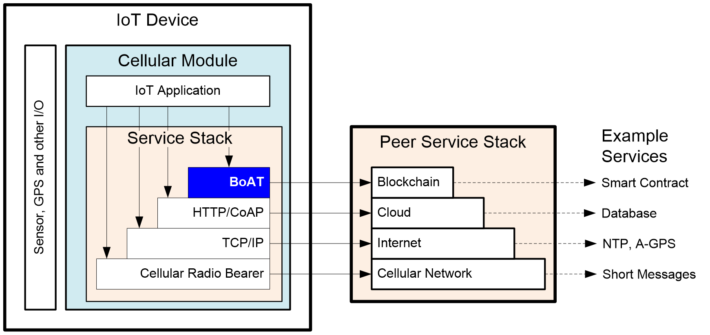

# 用户手册

## 引言

### 概述
本文介绍BoAT IoT Framework SDK 2.x的功能和使用方法。  
本文的预期读者为集成BoAT IoT Framework SDK的客户。

### 缩写术语
|术语   |解释                                        |
|:----- | :-------------------------------          |
|ABI    |Application Binary Interface               |
|API    |Application Programming Interface          |
|BoAT   |Blockchain of AI Things                    |
|IoT    |Internet of Things                         |
|JSON   |JavaScript Object Notation                 |
|OS     |Operating System                           |
|RLP    |Recursive Length Prefix (Encoding/Decoding)|
|RPC    |Remote Procedure Call                      |
|RTOS   |Real Time Operating System                 |
|SDK    |Software Development Kit                   |
|WASM   |Web Assembly                               |


## 功能和架构
BoAT IoT Framework是面向蜂窝模组的C语言区块链应用框架客户端软件，便于移植到各类模组中，帮助基于蜂窝模组的物联网应用连接区块链，实现数据上链等业务。BoAT IoT Framework SDK向物联网应用提供的功能包括发起链上交易、智能合约C接口代码自动生成、调用智能合约、管理区块链密钥等。

**已支持的区块链:**  
以太坊  
PlatON  
PlatONE  
FISCO-BCOS  
Hyperledger Fabric  
Huawei BCS (华为链)  

**支持的Target操作系统：**  
Linux  
RTOS  


**支持的Build操作系统：**  
Linux/Cygwin  

**主要特性：**  
区块链账号（钱包）参数配置  
区块链密钥对生成  
区块链账号的创建/加载/卸载  
转账交易  
智能合约调用（自动生成C调用接口）  
智能合约调用（手工构造）  


### 系统中的位置

BoAT IoT Framework以软件lib库的形式，运行于蜂窝模组的应用处理器上。其SDK以C源文件形式提供，在蜂窝模组的开发环境中编译。  

对于OpenCPU形态的蜂窝模组，BoAT IoT Framework库被物联网应用链接，形成具备区块链链接能力的物联网应用程序。  

图 2‑1展示了BoAT IoT Framwork在OpenCPU模组中的位置。BoAT作为应用层协议，位于模组已有的协议栈上方，向物联网应用提供区块链服务。BoAT的对等层是区块链网络层。  


图 2-1 BoAT IoT Framework在系统中的位置

对于非OpenCPU形态的蜂窝模组，BoAT IoT Framework库被模组固件链接，并由模组厂商扩展为AT命令，供上位机上的物联网应用调用，不再赘述。  

### BoAT IoT Framework SDK架构
BoAT IoT Framework SDK如图 2‑2所示，主要包含Wallet API、区块链客户端接口协议、远程过程调用接口、公共组件、硬件依赖组件以及工具组件。  


图 2-2 BoAT IoT Framework SDK架构

Wallet API是SDK提供给物联网应用调用的接口，具体包括SDK公共接口和针对不同区块链协议的钱包和交易接口。
区块链客户端接口协议主要实现针对不同区块链的交易接口协议，并通过RPC接口与区块链节点进行交互。
远程过程调用（RPC）接口实现针对不同通信承载的接口方式。该组件需要根据IoT设备支持的具体通信方式进行移植。
公共组件实现RLP编码、JSON编解码、字符串处理等公共功能。
硬件依赖组件为涉及不同硬件的移植组件，例如密码学加速器、安全存储、随机数等，需要根据具体硬件进行移植。SDK亦提供一套全软件的默认实现。
工具组件提供了根据Solidity或者WASM C++的智能合约ABI接口，生成C语言合约调用接口的Python工具。


### BoAT IoT Framework SDK代码结构
```
<SDKRoot>
|
+---build           | Directory to store object and executable files
+---demo            | Demo application
+---docs            | API reference manual
+---vendor          | Special vendor dependency
|   \---common      |     Universal soft algorithms implementation
|   \---platform    |     Dependency of different platforms
+---include         | Header files for application to include
+---lib             | Lib files for application to link with
+---sdk             | SDK source
|   +---third-party |     Third party libraries
|   +---include     |     Header files for SDK internal use
|   +---protocol    |     Blockchain client protocol implementation
|   +---rlp         |     RLP encoder
|   +---utilities   |     Utility APIs
|   +---wallet      |     SDK entry API implementation
+---tests           | Test cases
+---tools           | Tools for generating C interface from contract ABI
```
***注：`build`和`lib`目录在编译中生成。编译完成后，只有一级目录的`include`、`lib`，以及编译后自动生成的`boatconfig.h`(位于`vendor/platform/include`路径)头文件是应用需要的。***  

## BoAT IoT Framework SDK编译
### 软件依赖
BoAT IoT Framework SDK依赖于以下软件:

|依赖软件       |要求                                      |Build环境|Target环境|
| :------------| :------------------------------------    | :-----  | :-----  |
|Host OS       |Linux，或者Windows上的Cygwin               |Required |         |
|Target OS     |Linux                                     |         |Required |
|Compiler      |gcc，需要支持c99 (9.3.0 is tested)         |Required |         |
|Cross-compiler|arm-oe-linux-gnueabi-gcc (4.9.2 is tested)|Required |         |
|Make          |GNU Make (4.3 is tested)                  |Required |         |
|Python        |Python 2.7 (Python 3 is also compatible)  |Required |         |
|curl          |libcurl及其开发文件(7.55.1 is tested)      |Required on Linux default |Required on Linux default |


在编译和使用SDK之前，需要确保这些软件已经安装。在Ubuntu下，可以使用apt install命令安装相应的包。在Cygwin下，使用Cygwin自带的Setup程序进行安装。  

- Ubuntu
````
sudo apt install python
download curl-7.55.1.tar.xz : https://curl.se/download/curl-7.55.1.tar.xz
tar -xvf ./curl-7.55.1.tar.xz 
cd curl-7.55.1
./configure -enable-smtp -enable-pop3
make
sudo make install
sudo apt-get install libcurl4-openssl-dev
````
- Cygwin  

执行setup-x86_64.exe，安装make、gcc、python、libcurl等工具，如下图：


在Windows下，SDK不支持在Cygwin以外的环境下编译。如果必须在Cygwin以外运行（例如以Windows为Build环境的交叉编译器），请参照[以Windows为编译环境](####以windows为编译环境)章节对编译文件进行调整。

在RTOS上移植SDK时，应对libcurl依赖进行移植或将RPC方法重写。  


### 编译准备
#### BoAT IoT Framework SDK源码路径
SDK源码的保存路径中，自根目录起，各级目录名称应由英文字母、数字、下划线或减号组成，不应出现空格、中文以及加号、@、括号等特殊符号。


例如，以下为适合的路径：  
/home/developer/project-blockchain/boatiotsdk  
C:\Users\developer\Documents\project\boatiotsdk  


以下为不适合的路径：  
/home/developer/project+blockchain/boatiotsdk  
C:\Documents and Settings\developer\project\boatiotsdk  


如果无法避免在路径中出现上述不适字符，请使用以下方法规避：  
- Linux：在一个没有不适字符的路径中，建立一个指向SDK目录的符号链接：ln -s \<SDKRoot\> boatiotsdk，在该符号链接的路径下进行编译。  
- Windows：使用SUBST Z: \<SDKRoot\>命令虚拟一个盘符Z:（也可以是其他未使用的盘符），在Z:盘下进行编译。  


#### 引用的外部环境变量
根据需要，修改SDK以下文件中的环境变量：  
\<SDKRoot\>/vendor/platform/\<platform_name\>/external.env：配置外部编译环境依赖、硬件相关的头文件搜索路径。
在Host编译时，如果gcc和binutils已经安装在系统中，通常不需要修改这些环境变量配置。  

在交叉编译时，如果交叉编译环境需要配置特定的INCLUDE路径，需要在上述文件中添加路径。    

#### BoAT IoT Framework SDK配置
- 使能/禁能区块链协议  
顶层makefile中：
```
BOAT_PROTOCOL_USE_ETHEREUM  ?= 1
BOAT_PROTOCOL_USE_PLATON    ?= 1
BOAT_PROTOCOL_USE_PLATONE   ?= 1
BOAT_PROTOCOL_USE_FISCOBCOS ?= 1
BOAT_PROTOCOL_USE_HLFABRIC  ?= 1
BOAT_PROTOCOL_USE_HWBCS     ?= 1
```
根据需要，将相应变量的值改为`1`/`0`，或编译SDK时通过make \<BOAT_PROTOCOL_USE_XXX\>=<1|0>以使能或禁用相应的区块链协议。  
***注：由于PlatON，PlatONE和FISCO BCOS三个区块链钱包代码大量复用以太坊的钱包代码，所以这三个任意一个使能时，都需要把以太坊使能。***  
***注：由于hw_bcs区块链钱包代码大量复用fabric的钱包代码，所以使能hw_bcs时，都需要把fabric使能。*** 
- 日志打印级别调整  
根据需要，调整路径\<SDKRoot\>/vendor/platform/\<platform_name\>/src/log/boatlog.h中`BOAT_LOG_LEVEL`的值，来调整日志的打印级别。

### 合约C接口代码自动生成
智能合约是区块链上的可执行代码，在区块链虚拟机（例如EVM和WASM）上执行，并以远程过程调用（RPC）方式被客户端调用。  

不同的虚拟机和合约编程语言，有不同的应用程序二进制接口（ABI）。客户端在通过RPC调用合约函数时，必须遵照相应的ABI组装接口。  

SDK提供以下工具，用于根据合约ABI，生成相应的C接口代码，使得C代码中，可以像调用一般C函数一样，通过生成的接口代码调用链上智能合约：  

|转换工具                                |用途                                      |
|:------------------------------------- |:---------------------------------------- |
|\<SDKRoot\>/tools/eth2c.py             |根据以太坊Solidity的ABI，生成C调用代码      |
|\<SDKRoot\>/tools/fiscobcos2c.py       |根据FISCO-BCOS Solidity的ABI，生成C调用代码 |
|\<SDKRoot\>/tools/platoneSolidity2c.py |根据PlatONE Solidity的ABI，生成C调用代码    |
|\<SDKRoot\>/tools/platoneWASM2c.py     |根据PlatONE WASM的ABI，生成C调用代码        |

由于合约编程语言一般支持面向对象，而C语言不支持面向对象，无法使用统一范式传递对象，因此只有参数类型与C语言内置类型一致的合约函数，可以通过工具转换为C调用代码。具体的支持合约函数输入类型详见[合约调用（自动生成）](###合约调用（自动生成）) 章节。

在进行调用前，首先需要编译合约，将合约编译中生成的ABI接口描述JSON文件，拷贝至SDK相应目录中：

|合约ABI存放路径                                       |用途                                            |
|:--------------------------------------------------- |:----------------------------------------       | 
|\<SDKRoot\>/demo/demo_ethereum/demo_contract         |将以太坊的ABI JSON文件拷贝至该目录下              |
|\<SDKRoot\>/demo/demo_fiscobcos/demo_contract        |将FISCO-BCOS的ABI JSON文件拷贝至该目录下          |
|\<SDKRoot\>/demo/demo_platone/demo_contract/Solidity |将PlatONE（Solidity）的ABI JSON文件拷贝至该目录下 |
|\<SDKRoot\>/demo/demo_platone/demo_contract/WSAM     |将PlatONE（WASM）的ABI JSON文件拷贝至该目录下     |

***注：ABI的JSON文件必须以“.json”为文件名后缀。***

在编译Demo过程中，自动生成工具将根据合约ABI JSON文件，生成相应的C接口调用代码。如果编译中自动生成C接口失败，则需要从<SDKRoot>/contract的相应目录中，删除无法支持的ABI JSON文件（或者删除其中无法支持的接口），手工编写C代码，进行ABI接口组装，详见 [转账调用](###转账调用) 章节。  

### Host编译
Host编译指编译环境与目标环境一致，例如，在x86上编译x86程序。通常有两种使用Host编译的场景: 
1. 在软件调测阶段，在PC机上对软件功能进行测试。
2. 目标软件本身运行于基于x86/x86-64处理器的设备上，例如某些边缘网关。


#### 以Linux为编译环境
基于Linux发行版（例如Ubuntu）进行Host编译，一般无需特别配置编译环境，只需确保依赖软件都已安装。

编译遵照如下步骤:
1. 将SDK源码存放在符合[SDK源码路径](####SDK源码路径)要求的路径中。  
2. 可选：将要调用的智能合约的ABI JSON文件放在\<SDKRoot\>/demo/demo_\<protocol\>/demo_contract的对应目录中（参见[合约C接口代码自动生成](###合约C接口代码自动生成)章节）。  
3. 在\<SDKRoot\>目录下，执行以下命令:  
```
$make boatlibs
```

编译完成后，生成的库文件在./lib中。应用应当包含./include下的头文件，并链接./lib下的库，实现访问区块链的功能。参见[头文件和库](###头文件和库)章节。

#### 以Cygwin为编译环境
在Windows上，SDK不支持在Cygwin以外的环境进行编译，也不支持使用gcc以外的编译器进行编译。

编译步骤与在Linux下相同。


### 交叉编译
交叉编译中，一般需要根据具体编译环境，对编译配置文件等进行配置。

#### 以Linux为编译环境
##### 独立的交叉编译环境
独立的编译环境是指arm-oe-linux-gnueabi-gcc（或类似交叉编译器）已经安装在Linux系统中，可以独立调用。

SDK要求系统中至少应该设置以下环境变量，使之指向交叉编译环境：


|环境变量  |说明                      |
|:------- |:------------------------ | 
|CC       |指向交叉编译器gcc可执行文件 |
|AR       |指向交叉编译器ar可执行文件  |


当环境中没有定义CC和AR环境变量时，GNU make会默认CC=cc，AR=ar。通常，Linux系统中会安装host的gcc及bintuils编译环境，因此，未定义上述环境变量时，将会执行host编译。

在配置交叉编译环境时，通常需要执行特定shell脚本，对上述环境变量进行设置，使之指向交叉编译环境。对于bash shell，通常会执行类似如下的命令：
```
$source cross_compiler_config.sh     
```
或者
```  
$. cross_compiler_config.sh  
```
如上示例中的`cross_compiler_config.sh`并非本SDK中的脚本，而是交叉编译环境中的配置脚本，其具体名称和位置请参考交叉编译环境相关的说明。 
	
示例中的`source`或`.`是必需的，这使得该脚本在当前shell的上下文中执行，因而该脚本中对环境变量的修改仅能在当前shell中生效。


可以执行以下命令查看当前shell中的环境变量设置：  
```
$export
```

若环境变量CC和AR已设置，可以执行以下命令查看当前CC和AR的版本，以便确认是否已经指向了期望的交叉编译环境:  
```
${CC} -v  
${AR} -v
```

以上配置完成后，遵照[以Linux为编译环境](####以linux为编译环境)章节的步骤进行编译。


##### 与模组开发环境整合的交叉编译环境
有些OpenCPU模组在其所提供的开发环境中，已经整合了配套的交叉编译环境，使得客户无需另行在Linux系统中安装交叉编译器。这尤其便于在一台host电脑上，开发多个不同型号模组上的应用软件，而无需反复切换交叉编译环境。


###### 模组开发环境以GNU make为编译工具
若模组开发环境以GNU make为编译工具（各级源码目录内有Makefile），可以对BoAT IoT Framework SDK调整编译配置，将其纳入整合的模组开发环境中编译。

通常，模组开发环境中会提供客户代码的Example，并在编译体系中包含对客户示例代码Example的编译配置。首先将\<SDKRoot\>目录（以下例子中以boatiotsdk为目录名）复制到模组开发环境中的客户代码Example目录，然后修改针对客户代码Example的Makefile，增加一个编译BoAT IoT Framework SDK的target。

例如:  
假设原有编译环境中，客户代码Example的Makefile如下:  
```
.PHNOY: all  
all:  
    $(CC) $(CFLAGS) example.c -o example.o 

clean:  
	-rm -rf example.o
```
调整为:
```
.PHNOY: all boatiotsdkall boatiotsdkclean  
all: boatiotsdkall  
    $(CC) $(CFLAGS) example.c -o example.o 

clean: boatiotsdkclean    
	-rm -rf example.o  

boatiotsdkall:
	make -C boatiotsdk boatlibs

boatiotsdkclean:
	make -C boatiotsdk clean

```
其中，boatiotsdk为SDK所在目录，make后的-C参数指定进入boatiotsdk目录后按Makefile执行编译。


***注：Makefile中，target下的命令，必须一个Tab（ASCII码0x09）开头，而不能以空格开头。***

以上步骤仅仅是用于执行对SDK库的编译。SDK库编译完成后，还需将编译生成的lib库整合入模组开发环境。详见[头文件和库](###头文件和库)章节。

###### 模组开发环境采用非GNU Make编译工程
由于BoAT IoT Framework SDK以GNU make为编译工具，若模组开发环境采用非GNU Make的编译工具（例如Ninja、ant等），或者使用了编译工程的自动生成工具（如automake、CMake），则不能直接在模组开发环境中编译SDK。

在此类模组开发环境中编译SDK，需要将模组开发环境中的gcc、binutils编译工具释出，配置[独立的交叉编译环境](#####独立的交叉编译环境)章节所述环境变量，使之可以在系统中调用，等同于独立交叉编译环境，然后编译SDK。


#### 以Windows为编译环境
在Windows下，SDK不支持在Cygwin以外的环境下编译。如果以Windows为编译环境的交叉编译器只能在Cygwin以外运行，应对编译环境和编译配置文件进行调整。  
在Cygwin以外进行交叉编译时，仍然需要安装Cygwin，并调整Makefile。

###### 安装Cygwin

SDK编译工程依赖于一些Cygwin工具，需要安装的工具如下:  

|所需工具    |用途                                                                                                                     |
|:--------  |:----------------------------------------------------------------------------------------------------------------------- | 
|find       |需要Cygwin的find.exe用于递归搜索要编译的子目录。Windows自带有另一个同名但功能完全不同的FIND.EXE，不能使用。                     |
|rm         |用于删除指定目录和文件。Windows的cmd shell内置的RMDIR/RD和DEL命令分别只能用于删除目录（树）和文件，语法上与Cygwin的rm.exe不兼容。|
|mkdir      |用于创建一级或多级目录。Windows的cmd shell内置的MKDIR/MD命令具有相同功能，但语法不兼容                                         |
|GNU make   | 可以在Cygwin中安装make，也可以基于Windows上的编译器（例如Microsoft Visual Studio）自行编译GNU make。后者不依赖于Cygwin。      |

安装Cygwin之后，需要配置其路径。由于SDK编译所依赖的部分Cygwin工具与Windows自带工具同名，因此必须确保编译中引用的相关工具指向Cygwin的版本。

首先，在执行编译的cmd shell中，执行如下命令增加Cygwin的搜索路径：  
```
set PATH=%PATH%;\<Path_to_Cygwin\>\bin  
```
其中<Path_to_Cygwin>是Cygwin安装目录的绝对路径，如：C:\Cygwin64  


***注：上述命令可以编写在一个bat批处理文件中，或者直接加入Windows系统环境变量中，方便调用。如果直接加入Windows系统环境变量，不得将Cygwin置于%SystemRoot%\System32路径之前，否则在其他场景中调用Windows的FIND命令时，将错误地调用Cygwin的find版本，这将影响其他场景中使用Windows自带命令。***

然后，修改`<SDKRoot>/vendor/platform/<platform_name>/external.env`，为依赖工具加上路径:
```
# Commands
CYGWIN_BASE := C:\cygwin64  # Modify to actual path to Cygwin
BOAT_RM := $(CYGWIN_BASE)\bin\rm -rf
BOAT_MKDIR := $(CYGWIN_BASE)\bin\mkdir
BOAT_FIND := $(CYGWIN_BASE)\bin\find

```

以Windows10为例，将搜索路径加入Windows环境变量的方法为:  
a)	在Windows徽标菜单上点右键，选择“系统”  
b)	在“关于”页中点击“系统信息”  
c)	在“系统”页中点击“高级系统设置”  
d)	在“系统属性”页中点击“环境变量”  
e)	在“环境变量”页中点击“系统变量”中的“Path”，并点击“编辑”  
f)	在“编辑环境变量”页中点击“新建”，新增Cygwin的安装目录下的bin路径，并确保该项新增路径位于%SystemRoot%\system32这条路径之后的任意位置  


###### 其他调整
在Cygwin以外进行交叉编译时，除上节所述外，还需要进行下列调整：

1. 尝试make，如果提示路径错误，则将Makefile中相应的路径分隔符，从“/”修改为“\\”。不要一开始就把所有的“/”都改为“\\”，因为部分源自Linux的工具的Windows版本，可以识别“/”作为路径分隔符。
2. 配置[独立的交叉编译环境](#####独立的交叉编译环境)章节所述环境变量，使之指向正确的交叉编译环境。在这些环境变量中，路径应以“\\”为分隔符

### 编译和运行Demo
#### 准备
SDK提供基于以太坊、PlatON、PlatONE、FISCO-BCOS、Hyperledger Fabric和HW-BCS的Demo。在运行这些Demo之前，需要首先安装相应的区块链节点软件（或者有已知节点），并部署Demo所需的智能合约。

Demo所使用的智能合约及其ABI JSON文件放置在：  

|Demo智能合约                                                  |合约ABI JSON文件                                              |用途           |
|:----------------------------------------------------------- |:------------------------------------------------------------ |:------------ | 
|\<SDKRoot\>/demo/demo_ethereum/demo_contract/StoreRead.sol   |\<SDKRoot\>/demo/demo_ethereum/demo_contract/StoreRead.json   |以太坊演示     |
|\<SDKRoot\>/demo/demo_platone/demo_contract/WASM/my_contract.cpp    |\<SDKRoot\>/demo/demo_platone/demo_contract/WASM/my_contract.cpp.abi.json    |PlatONE演示    |
|\<SDKRoot\>/demo/demo_fiscobcos/demo_contract/HelloWorld.sol |\<SDKRoot\>/demo/demo_fiscobcos/demo_contract/HelloWorld.json |FISCO-BCOS演示 |


在运行以太坊的Demo之前，需要安装以太坊节点模拟器ganache，以及以太坊智能合约编译部署工具truffle。  
ganache及truffle工具可以访问该网站：https://truffleframework.com  
ganache有命令行界面的ganache-cli版本，以及图形界面的Ganache版本。命令行界面的ganache-cli和图形界面的Ganache 1.x版本不会存盘，如果ganache-cli或Ganache   1.x的进程被终止，部署的合约会丢失，下次启动需要使用命令truffle migrate --reset重新部署合约，重新部署的合约地址可能会变化。图形界面的Ganache   2.x版本可以建Workspace保存状态，关闭下次重新打开该Workspace后，部署过的合约仍然在无需重新部署。  
除了使用ganache模拟器，还可以使用Ropsten等以太坊测试网络（需要申请免费的测试token）。  

在运行PlatON的Demo之前，需要安装PlatON节点。  
PlatON源码及工具可以访问该网站：https://platon.network/

在运行PlatONE的Demo之前，需要安装PlatONE节点，以及智能合约编译和部署工具。  
PlatONE源码及工具可以访问该网站：https://platone.wxblockchain.com

在运行FISCO-BCOS的Demo之前，需要安装FISCO-BCOS节点和合约部署。  
FISCO-BCOS源码及安装部署步骤可以访问该网站：https://fisco-bcos-documentation.readthedocs.io

在完成节点（或模拟器）部署后，需要分别遵照相关网站的说明，部署Demo智能合约。智能合约部署成功后，将生成合约地址。

调用智能合约的Demo C代码放置在: 

|Demo C代码                                                  |用途                    |
|:---------------------------------------------------------- |:--------------------- |
|\<SDKRoot\>/demo/demo_ethereum/demo_ethereum_storeread.c    |以太坊合约演示用例       |
|\<SDKRoot\>/demo/demo_ethereum/demo_ethereum_transfer.c     |以太坊转账演示用例       |
|\<SDKRoot\>/demo/demo_platon/demo_platon_transfer.c         |PLATON转账演示用例      |
|\<SDKRoot\>/demo/demo_platone/demo_platone_mycontract.c     |PLATONE合约演示用例     |
|\<SDKRoot\>/demo/demo_fiscobcos/demo_fiscobcos_helloworld.c |FISCO-BCOS合约演示用例  |
|\<SDKRoot\>/demo/demo_fabric/demo_fabric_abac.c             |FABRIC合约演示用例      |
|\<SDKRoot\>/demo/demo_hw_bcs/demo_hw_bcs.c                  |HW-BCS合约演示用例      |

编译Demo之前，需要修改Demo的C代码中以下部分：
- 对于ETHEREUM、PLATON、FISCO-BCOS、PLATONE:
  1.	搜索`demoUrl`，将节点URL（含端口）填写为实际部署的节点或模拟器的IP地址和RPC端口
  2.	如果demo需使用原生私钥，则搜索`native_demoKey`，并将客户端私钥设置为：  
        -	对于ETHEREUM，设置为ganache生成的任意一个账户的私钥  
        - 对于PlatON，无需修改Demo中的私钥
        - 对于PlatONE，无需修改Demo中的私钥
        - 对于FISCO-BCOS，设置为<FISCO-BCOS_ROOT>/console/accounts下私钥对应的原生格式私钥
  3.	如果demo需使用原生私钥，则搜索`pkcs_demoKey`，并将客户端私钥设置为：  
        - 对于以太坊，设置为ganache生成的任意一个账户的私钥对应的PKCS格式私钥
        - 对于PlatONE，无需修改Demo中的私钥
        - 对于FISCO-BCOS，设置为<FISCO-BCOS_ROOT>/console/accounts下私钥
  4.	搜索`demoRecipientAddress`，修改为Demo合约的部署地址。
- 对于FABRIC:  
  1. 搜索`fabric_client_demokey`，设置客户端使用的私钥
  2. 搜索`fabric_client_democert`，设置客户端私钥对应的证书
  3. 如果demo启用TLS，则搜索`fabric_org1_tlsCert`、`fabric_org2_tlsCert`、`fabric_order_tlsCert`，设置CA证书链
  4. 搜索`fabric_demo_endorser_peer0Org1_url`、`fabric_demo_endorser_peer1Org1_url`、`fabric_demo_endorser_peer0Org2_url`、`fabric_demo_endorser_peer1Org2_url`，设置背书节点、排序节点的url地址
  5. 如果demo启用TLS，则搜索`fabric_demo_endorser_peer0Org1_hostName`、`fabric_demo_endorser_peer1Org1_hostName`、`fabric_demo_endorser_peer0Org2_hostName`、`fabric_demo_endorser_peer1Org2_hostName`，设置节点的主机名称
- 对于HW-BCS:  
  1. 搜索`hw_bcs_client_demokey`，设置客户端使用的私钥
  2. 搜索`hw_bcs_client_democert`，设置客户端私钥对应的证书
  3. 如果demo启用TLS，则搜索`hw_bcs_org1_tlsCert`、`hw_bcs_org2_tlsCert`，设置CA证书链
  4. 搜索`hw_bcs_demo_endorser_peer0Org1_url`、`hw_bcs_demo_endorser_peer0Org2_url`、`hw_bcs_demo_order_url`，设置背书节点、排序节点的url地址
  5. 如果demo启用TLS,则搜索`hw_bcs_demo_endorser_peer0Org1_hostName`、`hw_bcs_demo_endorser_peer0Org2_hostName`、`hw_bcs_demo_order_hostName`，设置节点的主机名称

#### 编译Demo
在\<SDKRoot\>目录下执行以下命令编译SDK的调用Demo：
```
$make demo
```
生成的Demo程序分别位于\<SDKRoot\>/build/demo/demo_\<protocol\>/<demo_name>路径下，< protocol>可以为`ethereum` `platon` `fisco-bcos` `platone` `fabric` `hwbcs`。


### 编译中的常见问题
1.  编译中提示类似“Makefile: 120: *** 缺失分隔符。 停止”的信息。  
该问题一般是因为Makefile中的target下的命令不是以Tab（ASCII码0x09）开头引起。注意按Tab键时，文本编辑器可能将Tab字符替换为若干空格。应将文本编辑器设置为不要用空格替代Tab。

2. 编译中提示“curl/curl.h”找不到  
该问题是因为系统中未安装curl及其开发文件引起。对于在Linux发行版上做Host编译而言，注意只安装curl包不够，还需要安装其开发文件包。开发文件包在不同的Linux发行版中有不同的名称，通常会命名为类似curl-devel，或者libcurl。具体请参照所使用的Linux发行版的软件包管理工具。    


如果curl采用源码编译，且未安装到系统目录，则应在external.env中指定其搜索路径，并在链接时指定curl库所在路径。  


在交叉编译中，尤其要注意搜索路径和库应指向交叉编译环境中的头文件和库，而不应指向执行编译的Host上的路径。

3. 交叉编译链接时提示字节序、位宽或ELF格式不匹配  
该问题通常是因为交叉编译中，部分库引用了Host的库，而Obj文件则是由交叉编译产生，或者，部分库为32位，另一部分为64位。应仔细核查所有库的路径，避免Host与Target的库混合链接，或者不同位宽的库混合链接。


可以使用如下命令查看库文件是ARM版本还是x86版本，以及位宽：  
```
$file \<lib或obj文件名\>
```
4. 编译中提示可执行文件找不到，或者参数错误  
常见提示:  
'make'不是内部或外部命令，也不是可运行的程序或批处理文件。  
mkdir… 命令语法不正确。  
FIND: 参数格式不正确  


该问题一般是因为在Windows下进行编译，但未安装Cygwin，或者未在Makefile中正确配置BOAT_RM、BOAT_MKDIR、BOAT_FIND的路径。请参照[以Windows为编译环境](####以windows为编译环境)章节安装Cygwin和配置Makefile。


## 编程模型

### 头文件和库
BoAT IoT Framework SDK编译完成后，应用可以通过SDK头文件和库，发起区块链交易或调用智能合约。

在SDK编译完成后，只有以下文件是应用在编译链接时需要的：
- \<SDKRoot\>/include下的所有头文件
- \<SDKRoot\>/lib下的所有库文件
- \<SDKRoot\>/vendor/platform/include/boatconfig.h头文件
- 如果使用了根据合约ABI JSON文件自动生成C接口代码，还应包含生成的智能合约C接口代码文件

1. 在应用中引用SDK头文件

- 在应用的头文件搜索路径中，增加\<SDKRoot\>/include，或者将\<SDKRoot\>/include下所有头文件拷贝至应用头文件目录中。
- 在应用的头文件搜索路径中，增加\<SDKRoot\>/vendor/platform/include，或者将\<SDKRoot\>/vendor/platform/include下的boatconfig.h头文件拷贝至应用头文件目录中。
- 在应用相关C代码中，添加以下头文件:
  ```
  #include "boatiotsdk.h" //SDK的入口头文件
  #include "boatconfig.h" //SDK的配置头文件
  ```
- 应用无需将SDK的其他头文件目录纳入搜索路径。

如果使用了根据合约ABI JSON文件自动生成C接口代码，还需包含生成的智能合约C接口代码的头文件，并将生成的`*.c`文件加入应用的编译脚本。


2. 在应用中链接SDK库文件

- 在应用的链接库中，依次增加\<SDKRoot\>/lib中两个静态库：  
  `libboatwallet.a`
  `libboatvendor.a`

- 在应用的链接库中，增加curl的动态库：  
  `-lcurl`

对于交叉编译，应当保证开发环境中的curl版本与目标板运行环境中的一致。


### SDK初始化和销毁
在调用SDK之前，必须调用BoatIotSdkInit()对SDK的全局资源进行初始化:
```
BOAT_RESULT BoatIotSdkInit(void);
```
在使用结束后，应调用BoatIotSdkDeInit()释放资源:
```
void BoatIotSdkDeInit(void);
```

### 区块链钱包创建/加载/卸载/删除
钱包是区块链账号的属性集合，这些属性包括私钥、区块链节点URL等关键属性。在发起交易或调用智能合约前，必须创建钱包或加载此前已经持久化保存的钱包。

#### 创建和加载钱包
SDK支持两类钱包：一次性钱包和持久性钱包。

一次性钱包在使用时临时创建，仅在内存中存在，关机后失效。  
持久性钱包在创建时会做持久性保存，关机再重新开机后，可以加载之前已经创建的持久性钱包。  

***注：<SDKRoot>/vendor/common/storage中的持久化实现方法仅供参考，在商业化产品中，建议根据实际硬件能力，考虑更安全的持久化方法。***

创建和加载钱包时，应保证总在同一个线程中调用BoatWalletCreate()。
在创建钱包时，需要根据具体区块链协议，传入钱包配置参数。创建钱包的函数描述如下：

```
BSINT32 BoatWalletCreate(BoatProtocolType protocol_type,
                         const BCHAR *wallet_name_str,
                         const void *wallet_config_ptr,
                         BUINT32 wallet_config_size);
```
参数:

|参数名称               |参数描述                                                          |
|:---------------------|:-----------------------------------------------------------------|
|protocol_type         |The blockchain protocol. See boattypes.h for supported protocol.  |
|wallet_name_str       |A string of wallet name.<br>If the given \<wallet_name_str\> is NULL, a one-time wallet is created.<br>Otherwise a persistent wallet with the given name will be created or loaded.|
|wallet_config_ptr     |Configuration (e.g. crypto key) for the wallet.<br>The exact configuration definition is determinted by the specified \<protocol_type\>.|
|wallet_config_size    |Size (in byte) of configuration specified by \<wallet_config_ptr\>.|

**返回值:**  
This function returns the non-negative index of the loaded wallet.
It returns -1 if wallet creation fails.

示例(私钥内部生成):
```
BoatEthWallet *g_ethereum_wallet_ptr = NULL;
BoatEthWalletConfig wallet_config    = {0};

/* wallet_config value assignment */
wallet_config.prikeyCtx_config.prikey_genMode = BOAT_WALLET_PRIKEY_GENMODE_INTERNAL_GENERATION;
wallet_config.prikeyCtx_config.prikey_type    = BOAT_WALLET_PRIKEY_TYPE_SECP256K1;

wallet_config.chain_id             = 1;
wallet_config.eip155_compatibility = BOAT_FALSE;
strncpy(wallet_config.node_url_str, demoUrl, BOAT_ETH_NODE_URL_MAX_LEN - 1);

/* create ethereum wallet */
index = BoatWalletCreate( BOAT_PROTOCOL_ETHEREUM, "boateth.keystore", &wallet_config, sizeof(BoatEthWalletConfig) );
```

#### 卸载钱包
卸载钱包将把已加载的钱包从内存中卸载。卸载不会删除已经持久化的钱包，但在再次加载之前，该持久性钱包将不能使用。

```
void BoatWalletUnload(BSINT32 wallet_index);
```
参数:

|参数名称        |参数描述                   |
|:--------------|:--------------------------|
|wallet_index   |The wallet index to unload.|


#### 删除钱包
删除钱包会将持久化的钱包删除。如果该钱包在删除之前已经加载，那么删除之后，该持久化钱包会变为一次性钱包，在卸载之前仍可使用。  
```
void BoatWalletDelete(BCHAR * wallet_name_str);
```
参数:

|参数名称            |参数描述                      |
|:------------------|:-----------------------------|
|wallet_name_str    |The wallet name to delete.    |

### 密钥生成
创建钱包时需要配置的密钥，可以由外部输入，也可以由SDK生成， 通过设置`prikeyCtx_config.prikey_genMode`为相应的值实现。

### 转账调用
从本账户向其他账户进行token转账（并非所有区块链协议都支持转账）。

以以太坊为例:
```
BOAT_RESULT BoatEthTransfer(BoatEthTx *tx_ptr,
                            BCHAR *value_hex_str);
```

参数:

|参数名称          |参数描述                                                                |
|:----------------|:-----------------------------------------------------------------------|
|tx_ptr           |Transaction pointer.                                                    |
|value_hex_str    |A string representing the value (Unit: wei) to transfer, in HEX format like "0x89AB3C".<br>Note that decimal value is not accepted. If a decimal value such as "1234" is specified, it's treated as "0x1234".|

**返回值:**  
This function returns BOAT_SUCCESS if transfer is successful.
Otherwise it returns one of the error codes.

### 合约调用（自动生成）

#### 自动生成合约的限制
由于合约编程语言一般支持面向对象，而C语言不支持面向对象，无法使用统一范式传递对象，因此只有参数类型与C语言内置类型一致的合约函数，可以通过工具转换为C调用代码。

对于Solidity编写的合约，工具支持以下参数类型：
  - address
  - bool
  - uint8
  - uint16
  - uint32
  - uint64
  - uint128
  - uint256
  - int8
  - int16
  - int32
  - int64
  - int128
  - int256
  - bytes1
  - bytes2
  - bytes3
  - bytes4
  - bytes5
  - bytes6
  - bytes7
  - bytes8
  - bytes9
  - bytes10
  - bytes11
  - bytes12
  - bytes13
  - bytes14
  - bytes15
  - bytes16 
  - bytes17
  - bytes18
  - bytes19
  - bytes20
  - bytes21
  - bytes22
  - bytes23
  - bytes24
  - bytes25
  - bytes26
  - bytes27
  - bytes28
  - bytes29
  - bytes30
  - bytes31
  - bytes32
  - bytes
  - string
  - T[N] : N > 0，N是整数，T是上面已支持的任意类型.
  - T[]  : T是上面已支持的任意类型，除了T[N].

对于C++编写的WASM合约，工具支持以下参数类型:
  - string
  - uint8
  - uint16
  - uint32
  - uint64
  - int8
  - int16
  - int32
  - int64
  - void

若合约函数中包含不支持的参数类型，自动转换工具将无法完成转换，必须手工编写合约。

#### 自动生成的合约调用接口
成功生成的合约调用接口为如下形式的C函数:
```
BCHAR * <合约ABI JSON文件名 >_< 合约函数名>(<钱包类型> *tx_ptr, …);
```
例如:
```
BCHAR * StoreRead_saveList(BoatEthTx *tx_ptr, Bbytes32 newEvent);
```
调用接口的第一个参数总为已初始化的交易对象的指针。

如果调用成功，调用接口的返回值是一个JSON格式的字符串。

***注：该字符串的内存在SDK内部分配，应用程序必须将该字符串复制到应用分配的内存中再做后续使用，不得修改返回的字符串的内容，或将该字符串的指针保存使用。***

改变区块链状态的合约函数，是指任何会改变区块链账本中的持久化存储信息的函数。例如，会对合约中的成员变量进行写入修改的函数，都是改变区块链状态的合约函数。如果一个合约函数只修改函数内的局部变量，而不会修改合约成员变量，那么该合约函数是不改变区块链状态的合约函数。

有一些合约编程语言中，两类合约函数在原型上有明确的修饰符区别，而另一些编程语言，没有明显的标识。在ABI中，这两类函数会有不同的标识。

例如，以如下以太坊Solidity合约为例:
```
contract StoreRead {
    
    bytes32[] eventList;
    
    function saveList(bytes32 newEvent) public {
        eventList.push(newEvent);
    }
    
    function readListLength() public view returns (uint32 length_) {
        length_ = uint32(eventList.length);
    }

    function readListByIndex(uint32 index) public view returns (bytes32 event_) {
        if (eventList.length > index) {
            event_ = eventList[index];
        }
    }
}
```
合约编译后，三个函数对应的ABI描述如下:
```
"abi": [
    {
      "constant": false,
      "inputs": [
        {
          "name": "newEvent",
          "type": "bytes32"
        }
      ],
      "name": "saveList",
      "outputs": [],
      "payable": false,
      "stateMutability": "nonpayable",
      "type": "function",
      "signature": "0xe648ba32"
    },
    {
      "constant": true,
      "inputs": [],
      "name": "readListLength",
      "outputs": [
        {
          "name": "length_",
          "type": "uint32"
        }
      ],
      "payable": false,
      "stateMutability": "view",
      "type": "function",
      "signature": "0xd0a80818"
    },
    {
      "constant": true,
      "inputs": [
        {
          "name": "index",
          "type": "uint32"
        }
      ],
      "name": "readListByIndex",
      "outputs": [
        {
          "name": "event_",
          "type": "bytes32"
        }
      ],
      "payable": false,
      "stateMutability": "view",
      "type": "function",
      "signature": "0xaa1a7122"
    },
]
```
上述合约中，eventList是合约的成员变量。saveList()会改变eventList的值，是改变区块链状态的合约函数；readListLength()和readListByIndex()函数有view修饰符，只读取eventList的值，是不改变区块链状态的合约函数。

特别注意，尽管改变区块链状态和不改变区块链状态的合约函数在原型上非常相似，但两者的调用原理有很大差别。通过该工具生成的C接口函数也是同样情况。


对区块链状态的任何改变，都需要通过区块链交易实施并在全网达成共识。改变区块链状态的合约函数是异步调用，在调用时，只是发起该次区块链交易，而在区块链网络将该交易打包出块前，该合约不会被执行。拿StoreRead的demo举例，相关调用代码如下所示：    
```
  BCHAR *result_str;
  result_str = StoreRead_saveList(&tx_ctx, (BUINT8*)"HelloWorld");
```
通过StoreRead_saveList函数获得的返回值result_str仅仅是用于标识该次交易的哈希值，而不是该StoreRead合约saveList函数的返回值。所以，在设计智能合约时，改变区块链状态的对外（public）接口函数，其试图返回的信息，应当保存在合约成员变量中。如果想获得经过更改后区块链的值，参考以下代码，其中hash为上一步中获得的交易的哈希值。
```
    BUINT32 list_len;
    if (BOAT_SUCCESS == BoatEthGetTransactionReceipt(hash))
    {
        list_len = StoreRead_readListLength(&tx_ctx);
        result_str = StoreRead_readListByIndex(&tx_ctx, list_len - 1);
    }
```
当BoatEthGetTransactionReceipt(hash)的返回值为BOAT_SUCCESS时，说明相应的改变区块链状态的合约函数调用已被成功上链。假设该合约只会由用户一人改变状态，然后通过StoreRead_readListLength()获得eventList数组的长度list_len，再通过StoreRead_readListByIndex()函数的调用获得StoreRead_saveList()上传上去的值"HelloWorld"。
而不改变区块链状态的合约函数，只需区块链节点读取其数据库内的已有信息，无需交易和共识。因此对该类函数的调用是同步调用，其返回值是就是相应合约函数的返回值。StoreRead合约的readListLength和readListByIndex两个函数就是此类合约函数。

***注：该处代码只能算伪代码，为了方便理解，进行了一定的简化。实际使用过程中，还需要对返回值进行相应的转换，具体细节可以参考demo_ethereum_storeread.c。***


#### 交易初始化
调用自动生成的合约接口，首先应初始化一个交易对象，然后调用生成的合约接口。
即使调用的合约函数是不改变区块链状态的，也需要先初始化一个交易对象。

以以太坊为例（不同的区块链协议参数有所差异）:
```
BOAT_RESULT BoatEthTxInit(BoatEthWallet *wallet_ptr,
                          BoatEthTx *tx_ptr,
                          BBOOL is_sync_tx,
                          BCHAR *gasprice_str,
                          BCHAR *gaslimit_str,
                          BCHAR *recipient_str)
```
参数:

|参数名称          |参数描述                                                                                        |
|:----------------|:-----------------------------------------------------------------------------------------------|
|wallet_ptr       |The wallet pointer that this transaction is combined with.                                      |
|tx_ptr           |Pointer a transaction object.                                                                   |
|is_sync_tx       |For a stateful transaction, specify BOAT_TRUE to wait until the transaction is mined.<br>Specifiy BOAT_FALSE to allow multiple transactions to be sent continuously in a short time.<br>For a state-less contract call, this option is ignored.|
|gasprice         |A HEX string representing the gas price (unit: wei) to be used in the transaction.<br>Set \<gasprice\> = NULL to obtain gas price from network.<br>BoatEthTxSetGasPrice() can later be called to modify the gas price at any time before the transaction is executed.|
|gaslimit         |A HEX string representing the gas limit to be used in the transaction.<br>BoatEthTxSetGasLimit() can later be called to modify the gas limit at any time before the transaction is executed.|
|recipient_str    |A HEX string representing the recipient address, in HEX format like"0x19c91A4649654265823512a457D2c16981bB64F5".<br>BoatEthTxSetRecipient() can later be called to modify the recipient at any time before the transaction is executed.|

**返回值:**  
This function returns BOAT_SUCCESS if initialization is successful.
Otherwise it returns one of the error codes.

示例:
```
BoatEthTx tx_ctx;
BOAT_RESULT result;
result = BoatEthTxInit(
                       wallet_ptr,
                       &tx_ctx,
                       BOAT_TRUE,
                       NULL,
                       "0x333333",
                       "0x9e7f3ae22cf97939a2e4cd68dd33bb29268a1ec9");
```
#### 调用合约接口
完成交易初始化后，可以调用自动生成的合约接口：

例如:
```
BCHAR *result_str;
result_str = StoreRead_saveList(&tx_ctx, (BUINT8*)"HelloWorld");
```
#### 自动生成合约的常见问题
**Q：编译时报如下错误**
```
    for abi_item in self.abi_object['abi']:
TypeError: list indices must be integers, not str
```
A：产生该问题的原因是使用了错误的输入文件。自动生成合约需要的JSON文件为编译器生成的完整JSON文件，如果仅仅拷贝ABI部分的内容自己创建一个JSON的话，需要在最外层增加ABI。具体格式可以参考：  
https://github.com/aitos-io/BoAT-X-Framework/issues/355

### 手动构造合约调用
如果自动生成工具无法生成C调用接口，则需要手工构造交易报文。另外，因为Fabric/hwbcs的调用本身就非常便捷，不需要自动生成合约调用接口的工具，所以需要手动调用合约。

手工构造交易需要遵循具体区块链协议的ABI接口。

**例1：以太坊交易构造**
- **步骤1** 调用BoatEthTxInit()进行交易初始化
- **步骤2** 设置交易参数
  - 设置交易参数nonce：  
    ```
    BOAT_RESULT BoatEthTxSetNonce(BoatEthTx *tx_ptr,
    BUINT64 nonce);
    nonce通常设置为BOAT_ETH_NONCE_AUTO，从网络获取nonce值。
    ```
  - 需要的话，设置交易参数value（初始化的交易对象中，value默认为0）:  
    ```
    BOAT_RESULT BoatEthTxSetValue(BoatEthTx *tx_ptr,
    BoatFieldMax32B *value_ptr);
    ```
- **步骤3** 对于改变区块链状态的合约调用（交易），设置交易参数data:
  ```
  BOAT_RESULT BoatEthTxSetData(BoatEthTx *tx_ptr,
  BoatFieldVariable *data_ptr);
  ```
  其中，data_ptr的格式遵循以太坊ABI，包括合约函数原型的Keccak-256哈希的前4字节作为Function Selector，随后依次排列各个参数：
  https://solidity.readthedocs.io/en/develop/abi-spec.html  
- **步骤4** 发送交易
  - 对于改变区块链状态的合约调用，调用如下合约函数：
    ```
    BOAT_RESULT BoatEthTxSend(BoatEthTx *tx_ptr);
    ```
  - 对于不改变区块链状态的合约调用，调用State-less合约函数：
    ```
    BCHAR * BoatEthCallContractFunc(BoatEthTx *tx_ptr,
                                    BCHAR *func_proto_str,
                                    BUINT8 *func_param_ptr,
                                    BUINT32 func_param_len);
    ```
    其中，func_param_ptr的格式遵循与步骤3相同的规则。

**例2：PlatONE交易构造**
- **步骤1** 调用BoatPlatONETxInit()进行交易初始化，其中交易类型字段根据实际交易类型进行设置。
- **步骤2** 设置交易参数
  - 设置交易参数nonce：
    ```
    BOAT_RESULT BoatPlatoneTxSetNonce(BoatEthTx *tx_ptr, BUINT64 nonce); 
    ```
    nonce通常设置为BOAT_PLATONE_NONCE_AUTO，从网络获取nonce值。
  - 需要的话，设置交易参数value（初始化的交易对象中，value默认为0）:
    ```
    BOAT_RESULT BoatPlatoneTxSetValue(BoatEthTx *tx_ptr,
    BoatFieldMax32B *value_ptr);
    ```
- **步骤3** 对于改变区块链状态的合约调用（交易），设置交易参数data:
  ```
  BOAT_RESULT BoatPlatoneTxSetData(BoatEthTx *tx_ptr,
  BoatFieldVariable *data_ptr);
  ```
  其中，data_ptr按RLP编码，依次编入如下字段:
  ```
  {
    TransactionType (Fixed unsigned 64bit, BigEndian),
    FunctionName,
    FunctionArgument1,
    FunctionArgument2,
  …
  }
  ```
  RLP编码按以下方法:
  - a) 调用RlpInitListObject()初始化顶层LIST对象
  - b) 调用RlpInitStringObject()初始化第一个编码字段对象
  - c) 调用RlpEncoderAppendObjectToList()将第一个编码字段对象加入顶层LIST对象
  - d) 重复b和c，直至所有编码对象都加入顶层LIST对象
  - e) 调用RlpEncode()对顶层LIST对象及其子对象进行RLP编码
  - f) 调用RlpGetEncodedStream()获取编码后的码流
  - g) 完成合约调用后，调用RlpRecursiveDeleteObject()销毁顶层LIST对象及其所有子对象

- **步骤4** 发送交易
  - 对于改变区块链状态的合约调用，调用如下合约函数：
    ```
    BOAT_RESULT BoatPlatoneTxSend(BoatEthTx *tx_ptr);
    ```

  - 对于不改变区块链状态的合约调用，调用State-less合约函数
    ```
    BCHAR * BoatPlatoneCallContractFunc(BoatPlatoneTx *tx_ptr,
                                        BUINT8 *rlp_param_ptr,
                                        BUINT32 rlp_param_len);
    ```
    其中，rlp_param_ptr的格式遵循与步骤3相同的规则。
    具体调用方法，可参照SDK所附的Demo的自动生成代码，这些代码位于\<SDKRoot\>/contract/generated下。

**例3：Hyperledger Fabric交易构造**
- **步骤1** 调用BoatHlfabricTxInit()进行交易初始化，其中参数根据实际使用进行设置。
- **步骤2** 如果节点自动查询功能没有开启，调用BoatHlfabricWalletSetNetworkInfo()进行网络参数设置。
- **步骤3** 调用BoatHlfabricTxSetTimestamp()设置时间戳，实时时间通过硬件相应功能获取。
- **步骤4** 如果节点自动查询功能开启，调用BoatHlfabricDiscoverySubmit()获取当前联盟链中所有节点信息。
- **步骤5** 设置交易参数。  
    使用demo_fabric_abac.c中的代码举例：  
    ```
    result = BoatHlfabricTxSetArgs(&tx_ptr, "invoke", "a", "b", "10", NULL);
    ```
    Fabric所有的函数调用输入数据均为string类型。拿上述代码来说，"invoke"是abac链码中的函数名。"a","b","10"均为该函数的相应的三个输入，不论链码中的相应变量是什么类型，均以string的形视作为输入。这也是不需要自动生成合约调用接口工具的原因。  
- **步骤6** 发送交易。
  - 对于改变区块链状态的合约调用，调用BoatHlfabricTxSubmit函数：
    ```
    BOAT_RESULT BoatHlfabricTxSubmit(BoatHlfabricTx *tx_ptr);
    ```

  - 对于不改变区块链状态的合约调用，调用BoatHlfabricTxEvaluate合约函数：
    ```
    BOAT_RESULT BoatHlfabricTxEvaluate(BoatHlfabricTx *tx_ptr);
    ```
    当返回的结果为BOAT_SUCCESS时，说明调用成功。

**例4：HW-BCS交易构造**
- **步骤1** BoatHwbcsTxInit()进行交易初始化，其中参数根据实际使用进行设置。
- **步骤2** 调用BoatHwbcsWalletSetNetworkInfo()进行网络参数设置。
- **步骤3** 调用BoatHwbcsTxSetTimestamp()设置时间戳，实时时间通过硬件相应功能获取。
- **步骤4** 设置交易参数。  
    使用demo_hw_bcs.c中的代码举例：  
    ```
    result = BoatHwbcsTxSetArgs(&tx_ptr, "initMarble", "a","1", NULL, NULL);
    ```
    hwbcs所有的函数调用输入数据均为string类型。拿上述代码来说，"initMarble"是hw链码中的函数名。"a","1"均为该函数的相应的两个输入，不论链码中的相应变量是什么类型，均以string的形视作为输入。这也是不需要自动生成合约调用接口工具的原因。  
- **步骤5** 发送交易。
  - 对于改变区块链状态的合约调用，调用BoatHwbcsTxSubmit函数：
    ```
    BOAT_RESULT BoatHwbcsTxSubmit(BoatHwbcsTx *tx_ptr);
    ```

  - 对于不改变区块链状态的合约调用，调用BoatHwbcsTxEvaluate合约函数：
    ```
    BOAT_RESULT BoatHwbcsTxEvaluate(BoatHwbcsTx *tx_ptr);
    ```
    当返回的结果为BOAT_SUCCESS时，说明调用成功。

## SDK往RTOS移植的建议
若将SDK移植到RTOS上，一般应遵循以下几点:
1. 解除对curl的依赖
    curl是一个Linux下的通信协议库，在SDK中用于支持http/https通信。区块链节点通常采用http/https协议进行通信。

    对于采用RTOS的模组，应当在\<SDKRoot\>/vendor/platform/\<platform_name\>/src/rpc中增加对模组的http/https的接口的调用封装，并修改\<SDKRoot\>/vendor/platform/\<platform_name\>/scripts/gen.py，关闭RPC_USE_LIBCURL并设置新增的RPC USE OPTION


2. 解除对文件系统的依赖

    SDK中使用文件作为钱包的持久化保存方法。若RTOS不支持文件系统，应当修改\<SDKRoot\>/vendor/platform/\<platform_name\>/port_xx/boatplatform_internal.c中文件操作相关的`BoatGetFileSize`, `BoatWriteFile`, `BoatReadFile`, `BoatRemoveFile`四个函数，将读/写文件修改为系统支持的持久化方法。


3. 内存裁剪

    若目标系统内存较为紧张，以致无法装入时，可以尝试对内存进行裁剪。可以裁剪的点包括：

    a)	根据实际需要，在<SDKRoot>/makefile中，关闭不需要支持的区块链Protocol  
    b)	根据实际情况，减小<SDKRoot>/include/api_\<protocol\>.h中，节点URL字符串的存储空间BOAT_XXX_NODE_URL_MAX_LEN  
    c)	根据实际需要，减小<SDKRoot>/include/boatwallet.h中，支持的钱包数量BOAT_MAX_WALLET_NUM  
    d)	根据实际情况，减小<SDKRoot>/include/boatrlp.h中，一个LIST中支持的最大成员个数MAX_RLP_LIST_DESC_NUM  
    e)	根据实际情况，减小<SDKRoot>/sdk/protocol/common/web3intf/web3intf.h中，web3数据缓冲区的自增步长WEB3_STRING_BUF_STEP_SIZE


    如果经过上述裁剪，内存仍然过大无法装入，可以尝试：  
    a)	根据实际需要，采用针对具体交易参数的简易RLP编码方法，替代<SDKRoot>/sdk/rlp中递归的通用RLP编码方法  
    b)	根据实际需要，裁剪实际不会用到的API  

## BoAT的扩展AT命令建议

### 创建/加载钱包 AT^BCWALT
|Command                                                                         |Response(s)                                              |
|:-----------------------------------------------------------------------------  |:------------------------------------------------------- | 
|Write Command:<br>^BCWALT=\<protocol_type\>,\<wallet_name\>[,\<wallet_config\>] |^BCWALT: \<wallet_index\><br>OK<br>                      |
|Test Command:<br>^BCWALT=?                                                      |+BCWALT: (list of supported \<protocol_type\>s)<br>OK<br>|

功能：
创建/加载钱包，与BoatWalletCreate()对应。

参数：
\<protocol_type\>: integer type
- 1: Ethereum
- 2: PlatONE

\<wallet_name\>: string type; 
a string of wallet name

\<wallet_config\>: string type;
A JSON string representing the wallet configuration of \<protocol_type\>. The exact format is manufacture specific.

\<wallet_index\>: integer type; 
the index of the created wallet

### 卸载钱包AT^BUWALT
|Command**                               |Response(s)                                            |
|:-------------------------------------- |:----------------------------------------------------- | 
|Write Command:<br>^BUWALT=<wallet_index>|<br>OK<br>                                             |
|Test Command:<br>^BUWALT=?              |+BUWALT: (list of loadeded \<wallet_index\>s)<br>OK<br>|

功能：
卸载钱包，与BoatWalletUnload()对应。

参数:
\<wallet_index\>: integer type; wallet index to unload, previously returned by ^BCWALT
### 删除钱包AT^BDWALT
|Command                                  |Response(s)   |
|:--------------------------------------- |:------------ | 
|Write Command:<br>^BDWALT=\<wallet_name\>|<br>OK<br>    |

功能：
删除已创建的持久化钱包，与BoatWalletDelete()对应。

参数:
\<wallet_name\>: string type; the name of the wallet to delete

### 合约函数调用AT^BCALLFUNC
|Command                                                    |Response(s)   |
|:--------------------------------------------------------- |:------------ | 
|Write Command:<br>^BCALLFUNC=\<wallet_index\>,\<tx_object\>|<br>OK<br>    |

功能：
发起合约调用，与根据合约ABI JSON文件生成的C调用接口对应。

参数:
\<wallet_index\>: integer type; wallet index combined with the contract call, previously returned by ^BCWALT

\<tx_object\>: string type;
A JSON string representing the transaction object as per the generated C contract interface. The exact format is manufacture specific.

\<wallet_index\>: integer type; the index of the created wallet

### 转账AT^BTRANS
|Command                                                           |Response(s)   |
|:---------------------------------------------------------------- |:------------ | 
|Write Command:<br>^BTRANS=\<wallet_index\>,\<recipient\>,\<value\>|<br>OK<br>    |

功能：  
发起指定Wallet的转账（并非所有区块链都支持转账）。例如，对以太坊，与BoatEthTransfer()对应。

参数:  
\<wallet_index\>: integer type; wallet index combined with the transfer (the payer), previously returned by ^BCWALT

\<recipient\>: string type;  
A HEX string representing the recipient (payee) address.

\<value\>: integer type; the value to transfer, represented by the smallest token unit of the protocol (e.g. for Ethereum, the unit is wei or 10-18 ether).
## 参考资料
[1].BoAT IoT Framework SDK Reference Manual, AITOS.20.70.100IF, V1.0.0
